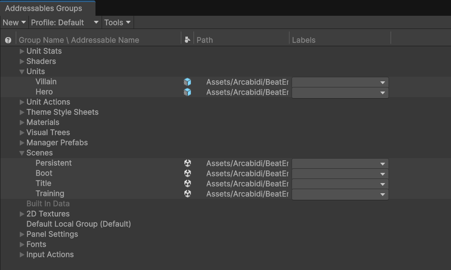
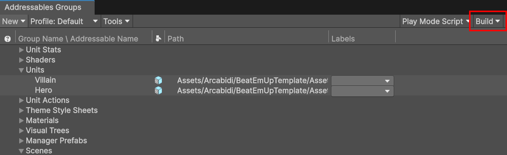
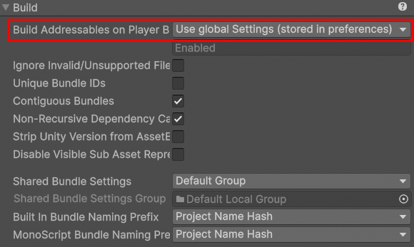

# Assets

!!! Summary

    This section explains how items are dynamically loaded and unloaded using Unity's Addressables package.

## Design decisions

Unity’s default Asset system is the [Resource system](https://docs.unity3d.com/6000.0/Documentation/Manual/UnderstandingPerformanceResourcesFolder.html). Developers store assets in one or more folders named Resources and load or unload Objects from those assets at runtime.

!!! Danger

    The Resource system is very limited and prone to bloating. [Unity themselves do not recommend using the Resource system for projects past the prototyping phase](https://learn.unity.com/tutorial/assets-resources-and-assetbundles#5c7f8528edbc2a002053b5a6).

An alternative to the Resource system is to use [AssetBundles](https://docs.unity3d.com/Manual/AssetBundlesIntro.html). An AssetBundle is an archive file that contains platform-specific non-code content (models, textures, prefabs, audio, etc.) that Unity can load at runtime. AssetBundles are commonly used to update or add content post-release such as DLC, limited-time promotional events, or holiday themes. They can reduce initial file size, optimize asset loading based on user platform, reduce memory runtime pressure, and even allow content to be reused from project to project.

In 2019 Unity released a new quality-of–life way to manage AssetBundles. This template will use that new asset system.

## Addressables package

The [Addressables package](https://docs.unity3d.com/Packages/com.unity.addressables@1.21/manual/index.html) is not enabled by default and must be installed via `Window > Package Manager`.

<figure markdown="span">
    
</figure>

Once it is installed, the first step is to mark all Addressable content in the project. This is done by selecting an asset in the Project window and checking the now available Addressable box in the Inspector. In the example below, the Persistent scene has been marked as one of the many Addressable assets in our example project. You can find it at `Assets/_Project/Gameplay/Scenes`.

<figure markdown="span">
    
</figure>

The second step is to organize Addressable content into groups. You can view a list of all Addressables in the project at `Window > Asset Management > Addressables > Groups`. Here you can see all 17 Addressables groups we have created for our example game and the assets in each.

<figure markdown="span">
    
</figure>

When you mark an asset as Addressable it is placed in the Default Local Group by default, but you can create your own custom groups and move assets into them or set a new default folder if you wish. 
 
The third step is to convert the assets in your Addressables groups into AssetBundles. Whenever Addressable assets are modified during development, the project’s Addressables content must be rebuilt before building the Player. This can be done in one of two ways. The first is manually through the Build Menu of the groups window.

<figure markdown="span">
    
</figure>

The second is automatically as part of the Player build. This can be configured in the project’s Addressable Asset Settings file located at `Assets/AddressableAssetsData/AddressableAssetSettings.asset`.

<figure markdown="span">
    
</figure>

While running the Addressables content build at the same time as the Player build may be convenient, it could increase build time on larger projects, especially if no assets have been modified since the last build. 
 
Lastly, the way each Addressables group is packed into AssetBundles can be adjusted by changing its BundleMode. These settings can be found at `Assets/AddressableAssetsData/AssetGroups/[Addressable Group Name].asset`, where each Addressables group has its own settings file.

<figure markdown="span">
    
</figure>

Based on the BundleMode chosen, the assets in an Addressable group will either be Packed Together into a single bundle, Packed Separately into their own individual bundles, or Packed Together By Label into a bundle with all other assets that share the same label (regardless of Addressable group). The exceptions are Scene assets, which are always packed separately.

### Build reports

To view the AssetBundles that were created, you must enable [Build Reports](https://docs.unity3d.com/Packages/com.unity.addressables@1.21/manual/BuildLayoutReport.html) at `Edit > Preferences > Addressables > Debug Build Layout`.

<figure markdown="span">
    
</figure>

You can set the report to open after every build, or view the reports manually at `Window > Asset Management > Addressables > Addressables Report`.

<figure markdown="span">
    
</figure>

The report will also notify you of any potential risks for asset duplication, where a single non-Addressable asset is referenced by multiple AssetBundles. If this happens, you may want to mark the risky asset as Addressable and assign it to an appropriate group.

### Profiler module

Once BuildReports are enabled, the Addressables [Profiler module](https://docs.unity3d.com/Packages/com.unity.addressables@1.21/manual/ProfilerModule.html) can notify you at runtime whenever AssetBundles are loaded or unloaded. You can use this information to optimize the memory usage of your game. The first step is to install the Unity Profiling Core API from the PackageManager.

<figure markdown="span">
    
</figure>

Next, open the Profiler window at `Window > Analysis > Profile` and enable Addressable Assets from the Profiler Modules drop down menu so that they can be monitored.

<figure markdown="span">
    
</figure>

Lastly, the Profiler module only supports the Use Existing Build setting for the Play Mode Script. Make sure your Addressables build exists, then select the appropriate option from the Play Mode Script menu of the groups window.

<figure markdown="span">
    
</figure>

Now when you enter Play Mode, the module view can display whatever Addressables content is loaded at any given point in time.

<figure markdown="span">
    
</figure>