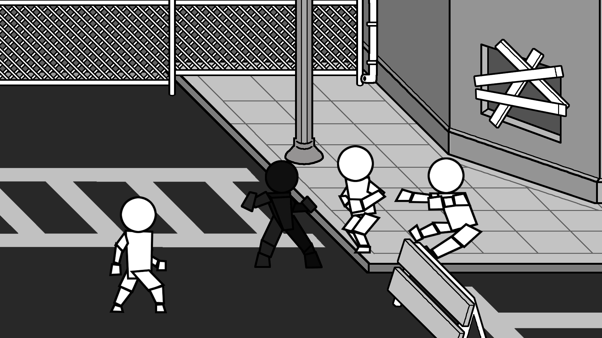
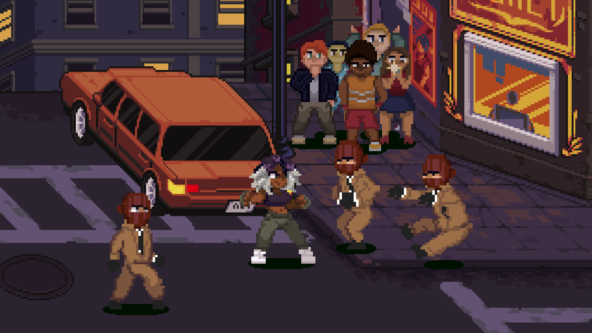

# Introduction

!!! Summary

    Welcome to the documentation site for the 2.5D Beat 'Em Up Template developed by Arcabidi! 
    This page will get you started on everything you need to know to use this package.

Want to make a 2.5D beat 'em up game but don't know where to start? This template provides a starting point for beginner and intermediate developers to build their very own belt-scrolling brawler.

This package combines 2D visuals with 3D depth to add a modern feel to the classic beat 'em up experience. Its modular design allows for extensive customization (units, abilities, AI, etc.), and it can easily be adapted to support various 2.5D genres beyond beat 'em ups such as platformers or adventure games.

<!-- https://github.com/sneas/img-comparison-slider?tab=readme-ov-file -->
<figure markdown="span">
    
    <link
        rel="stylesheet"
        href="https://cdn.jsdelivr.net/npm/img-comparison-slider@8/dist/styles.css"
    />
    
        
        
    </img-comparison-slider>
    <figcaption>An example of prototype to product</figcaption>
</figure>

## Section guide

- [__Releases__](releases.md) see what new features are included in the latest version
- [__Unity Editor__](unity-editor.md) understand how the project is organized in the Unity Editor
- [__Assets__](assets.md) learn how to dynamically load and unload items at runtime
- [__Scenes__](scenes.md) take control of how your game transitions between its sections
- [__Scripting__](scripting/index.md) create custom code to fit your game's needs
- [__Systems__](scripting/systems/index.md) deep dive into the twelve game systems that power the template
- [__Utilities__](scripting/utilities.md) supplementary code that can be used for any game when needed

## Required packages

!!! Info

    This template only uses official packages made by Unity. They should be installed automatically with the project as dependencies, but they can also be installed manually via `Window > Package Manager`.

* [Unity's Input System](https://docs.unity3d.com/Packages/com.unity.inputsystem@1.11/manual/index.html) (For player input. Installed by default in Unity 6.)
* [Unity's UI Toolkit](https://docs.unity3d.com/6000.0/Documentation/Manual/UIElements.html) (For creating UI. Installed by default in Unity 6.)
* [Unity's Addressables](https://docs.unity3d.com/Packages/com.unity.addressables@2.3/manual/index.html) (For asset management. Must be installed via Package Manager.)

## Downloads

[Unity Store]()