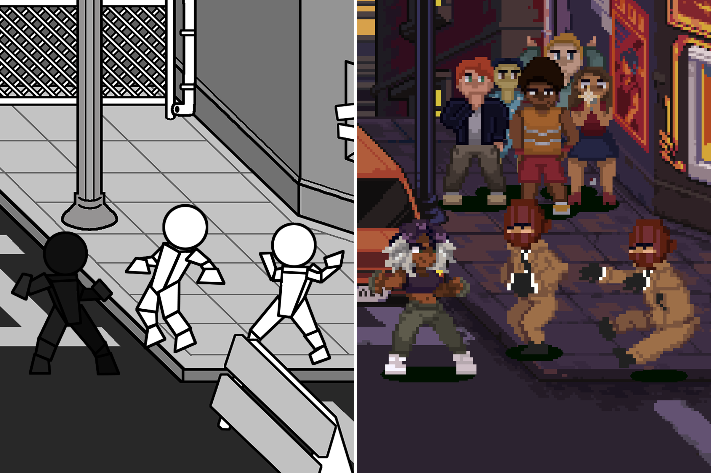

# Introduction

!!! Summary

    Welcome to the documentation site for the 2.5D Beat 'Em Up Template developed by Arcabidi! This section will get you started on everything you need to know to use this package.

Want to make a 2.5D beat ‘em up game but don’t know where to start? Look no further! This template demonstrates all the core systems needed to support your very own sidescrolling brawler. 
 
The example game included in this package provides a starter framework for new Unity programmers. Explore this site to understand how all ten core game systems function independently and interact!

<figure markdown="span">
    
    <figcaption>An example of prototype to product</figcaption>
</figure>

## Required packages

!!! Info

    This template only uses official packages made by Unity. They should be installed automatically with the project as dependencies, but they can also be installed manually via `Window > Package Manager`.

* [Unity's Input System](https://docs.unity3d.com/Packages/com.unity.inputsystem@1.11/manual/index.html) (for player input)
* [Unity's UI Toolkit](https://docs.unity3d.com/6000.0/Documentation/Manual/UIElements.html) (for creating ui)
* [Unity's Addressables](https://docs.unity3d.com/Packages/com.unity.addressables@2.3/manual/index.html) (for asset management)

## Section guide

- <!--:fontawesome-brands-html5:--> [__Releases__](releases.md) see what new features are included in the latest version
- <!--:fontawesome-brands-js:--> [__Unity Editor__](unity-editor.md) understand how the project is organized in the Unity Editor
- <!--:fontawesome-brands-css3:--> [__Assets__](assets.md) learn how to dynamically load and unload items at runtime
- <!--:fontawesome-brands-internet-explorer:--> [__Scenes__](scenes.md) take control of how your game transitions between its sections
- <!--:fontawesome-brands-html5:--> [__Scripting__](scripting/index.md) create custom code to fit your game's needs
- <!--:fontawesome-brands-js:--> [__Systems__](scripting/systems/index.md) deep dive into the ten game systems that power the template

