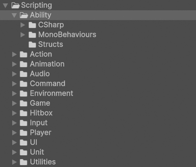

# Ability

!!! Summary

    This page summarizes all aspects of the ability system, which includes everything and anything units can do.

## Scripting

All code files below are at `Assets/_Project/Scripting/Systems/11 - Ability`.

<figure markdown="span">
    
</figure>

### CSharp

These scripts are not meant to be attached to GameObjects in the scene. Many of them represent static event classes that are meant to be invoked, or are abstract classes representing concepts.

#### AbilityData

AbilityData represents all data transferred by a [hitbox](hitbox.md#hitboxes) to targets on hit.

`AbilityData.cs` defines what is common across all AbilityData, regardless of game. There is currently nothing common across all AbilityData, so this abstract class only serves as an empty base class for its potential child classes.

`JabAbilityData.cs` defines the data that is transferred by the [JabHitbox](hitbox.md#hitboxes) in the [Jab](#abilities) ability. This includes things like damage and hitstun duration.

`CrossAbilityData.cs` defines the data that is transferred by the [CrossHitbox](hitbox.md#hitboxes) in the [Cross](#abilities) ability. This includes things like a knockback's [direction](game.md#direction), magnitude, and duration.

### MonoBehaviours

These scripts are meant to be attached to GameObjects in the scene as components and inherit from Unity's [MonoBehaviour](https://docs.unity3d.com/6000.0/Documentation/Manual/class-MonoBehaviour.html) class.

#### Abilities

Abilities represent skills that can be performed by a user.

!!! Note

    Abilities are different from [UnitActions](action.md#unitactions). For example, a UnitAction named `FireBarrage` could have a unit cast three random fire spells in succession, each of which are their own separate ability.

`Ability.cs` defines what is common across all abilities regardless of game. This includes things like having a reference to the [Command](command.md#commands) instance that created it and a way to execute the ability.

`BeltScrollMove.cs` executes belt scroll movement, where a unit performs 3D movement from a 2D perspective where the "up" input traverses depth instead of height. This component is attached to the Hero and Villain prefabs in the Training scene at runtime whenever they move.

`Jump.cs` executes a jump where a unit pushes upward from the ground to become airborne. This component is briefly attached to the Hero prefab in the Training scene at runtime whenever it jumps.

`Jab.cs` executes a jab where a unit throws a quick, sharp punch with their leading hand. This component is briefly attached to the Villain prefab in the Training scene at runtime whenever it attacks.

`Cross.cs` executes a cross where a unit throws a strong, straight punch with their rear hand. This component is briefly attached to the Hero prefab in the Training scene at runtime whenever it attacks.

#### AbilityManagers

AbilityManagers manage [abilities](#abilities) once they have been added to a user.

`AbilityManager.cs` represents a basic, general-purpose AbilityManager used by the template. It notifies [UnitControllers](unit.md#unitcontrollers) and [StateMachineBehaviours](animation.md#statemachinebehaviours) when abilities implementing relevant interfaces are added. This component can be found attached to the Human prefab and its Hero and Villain prefab variants. These prefabs are instantiated as children of the HumanPlayerUnitManager and AIPlayerUnitManager GameObjects in the Training scene at runtime.

### Structs

These scripts contain user-defined data types that combine fields of different types underneath a single type. All classes in this folder use the `struct` keyword in their declaration.

#### AbilityDataPacket

`AbilityDataPacket.cs` contains the [AbilityData](#abilitydata) sent from [Hitboxes](hitbox.md#hitboxes) by an [Ability](#abilities). The AbilityData within can be modified by the ability, the [Command](command.md#commands) instance that created the ability, the user of the ability, and the target of the ability. The AbilityDataPacket saves a version of the AbilityData at each step in case it is needed for reference.