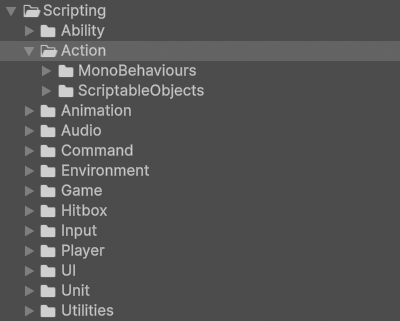

# Action

!!! Summary

    This page summarizes all aspects of the action system, which is responsible for controlling which in-game actions a unit can perform.

## Scripting

The code files in this section are at `Assets/_Project/Scripting/Systems/09 - Action`.

<figure markdown="span">
    
</figure>

### MonoBehaviours

These scripts are meant to be attached to GameObjects in the scene as components and inherit from Unity's [MonoBehaviour](https://docs.unity3d.com/6000.0/Documentation/Manual/class-MonoBehaviour.html) class.

#### UnitActionManagers

UnitActionManagers manage the [UnitActions](#unitactions) a unit knows how to perform.

`UnitActionManager.cs` represents a basic, general-purpose UnitActionManager in the template. This component can be found attached to the Human prefab and its Hero and Villain prefab variants. These prefabs are instantiated as children of the HumanPlayerUnitManager and AIPlayerUnitManager GameObjects in the Training scene at runtime.

### ScriptableObjects

These scripts contain centralized data that can be conveniently accessed from scenes and assets within a project. All classes in this folder derive from Unity's base [ScriptableObject](https://docs.unity3d.com/6000.0/Documentation/ScriptReference/ScriptableObject.html) class.

ScriptableObjects are stored on disk and live independently of GameObjects and class instances. They are used as data containers to save large amounts of data, reducing a project’s memory usage by not duplicating values.

#### UnitActions

UnitActions represent actions that units can perform.

!!! Note

    UnitActions are different from [abilties](ability.md#abilities). For example, a UnitAction named `FireBarrage` could have a unit cast three random fire spells in succession, each of which are their own separate ability.

`UnitAction.cs` defines what is common across all UnitActions regardless of game. This includes things like returning an instanced version of itself called a [Command](command.md#commands).

`BeltScrollMoveUnitAction.cs` represents the knowledge of performing the [BeltScrollMove](ability.md#abilities) ability. Both the Hero and Villain prefabs know this UnitAction in their [UnitActionManager](#unitactionmanagers) components.

`JumpUnitAction.cs` represents the knowledge of performing the [Jump](ability.md#abilities) ability. The Hero prefab knows this UnitAction in its [UnitActionManager](#unitactionmanagers) component.

`JabUnitAction.cs` represents the knowledge of performing the [Jab](ability.md#abilities) ability. The Villain prefab knows this UnitAction in its [UnitActionManager](#unitactionmanagers) component.

`CrossUnitAction.cs` represents the knowledge of performing the [Cross](ability.md#abilities) ability. The Hero prefab knows this UnitAction in its [UnitActionManager](#unitactionmanagers) component.