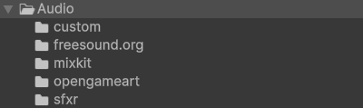
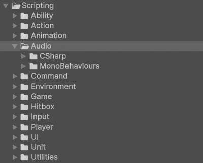
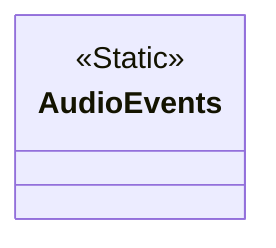
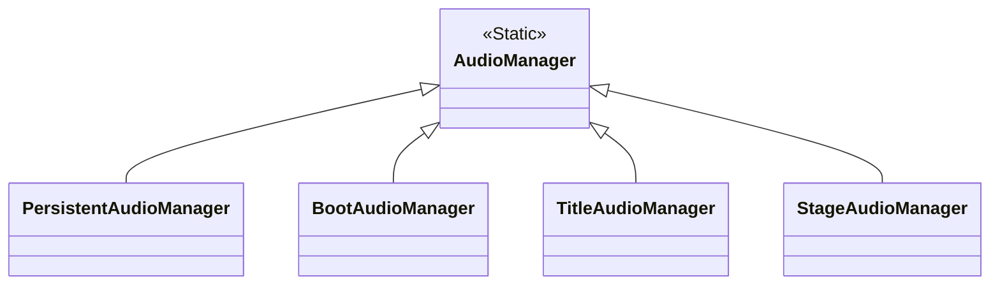

# Audio

!!! Summary

    This page summarizes all aspects of the audio system, which is responsible for playing dynamic background music and sound effects.

## Audio folder

The non-code files in this section are located at `BeatEmUpTemplate/Assets/Audio`.

<figure markdown="span">
    
</figure>

Each subfolder is named after the source of the [AudioClips](https://docs.unity3d.com/Manual/class-AudioClip.html) inside.

## Scripting

The code files in this section are at `BeatEmUpTemplate/Assets/Scripting/Systems/05 - Audio`.

<figure markdown="span">
    
</figure>

### CSharp

These scripts are not meant to be attached to GameObjects in the scene. Many of them represent static event classes that are meant to be invoked, or are abstract classes representing concepts.

#### AudioEvents

`AudioEvents.cs` contains all events related to audio. Events in this class are invoked whenever you need to signal a change in the game's audio. This includes things like changing the background music, playing a sound effect, or updating the volume.

### MonoBehaviours

These scripts are meant to be attached to GameObjects in the scene as components and inherit from Unity's [MonoBehaviour](https://docs.unity3d.com/6000.0/Documentation/Manual/class-MonoBehaviour.html) class.

#### AudioManagers

AudioManagers manage the background music and sound effects within a scene.

`AudioManager.cs` defines what is common across all AudioManagers, regardless of game. This includes things like maintaining a data structure of [AudioSources](https://docs.unity3d.com/Manual/class-AudioSource.html) to play.

`PersistentAudioManager.cs` defines AudioManager behaviour unique to the Persistent scene, like playing sound effects when the mouse enters a [Button](https://docs.unity3d.com/6000.0/Documentation/ScriptReference/UIElements.Button.html). This component can be found attached to the AudioManager GameObject in the Persistent scene.

`BootAudioManager.cs` defines AudioManager behaviour unique to the Boot scene, like playing sound effects when the Company Logo video player starts. This component can be found attached to the AudioManager GameObject in the Boot scene.

`TitleAudioManager.cs` defines AudioManager behaviour unique to the Title scene, like playing sound effects when a coin is first inserted. This component can be found attached to the AudioManager GameObject in the Title scene.

`StageAudioManager.cs` defines AudioManager behaviour unique to stage scenes, like pausing audio when the game is paused. This component can be found attached to the AudioManager GameObject in the Training scene.

!!! Note

    For this template we've defined stages as scenes where the main gameplay takes place. For now this is just the Training scene, but the stage designation also includes any future levels.