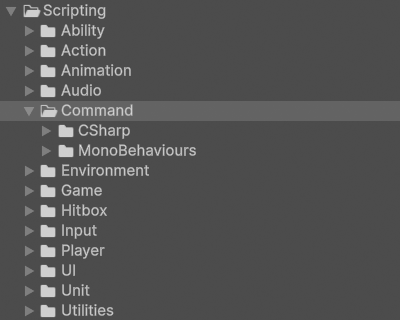

# Command

!!! Summary

    This page summarizes all aspects of the command system, which is responsible for determining when in-game actions should be performed.

## Scripting

The code files in this section are at `Assets/_Project/Scripting/Systems/10 - Command`.

<figure markdown="span">
    
</figure>

### CSharp

These scripts are not meant to be attached to GameObjects in the scene. Many of them represent static event classes that are meant to be invoked, or are abstract classes representing concepts.

#### Commands

Commands represent instances of [UnitActions](action.md#unitactions) that can be queued for execution. A [UnitActionManager](action.md#unitactionmanagers) requests a Command instance of a UnitAction from its [ScriptableObject](https://docs.unity3d.com/6000.0/Documentation/ScriptReference/ScriptableObject.html) and then passes the Command to a [CommandInvoker](#commandinvokers).

`Command.cs` defines what is common across all Commands, regardless of game. This includes things like references to its name, its user, and an execution method.

### MonoBehaviours

These scripts are meant to be attached to GameObjects in the scene as components and inherit from Unity's [MonoBehaviour](https://docs.unity3d.com/6000.0/Documentation/Manual/class-MonoBehaviour.html) class.

#### CommandInvokers

CommandInvokers invoke [Commands](#commands) for execution. A [UnitActionManager](action.md#unitactionmanagers) requests a Command instance of a [UnitActions](action.md#unitactions) from its [ScriptableObject](https://docs.unity3d.com/6000.0/Documentation/ScriptReference/ScriptableObject.html) and then passes the Command to a CommandInvoker. 

`CommandInvoker.cs` represents a basic, general-purpose CommandInvoker used by our template. It simply executes Commands as soon as it receives them instead of inserting them into any sort of queue. This component can be found attached to the Human prefab and its Hero and Villain prefab variants. These prefabs are instantiated as children of the HumanPlayerUnitManager and AIPlayerUnitManager GameObjects in the Training scene at runtime.