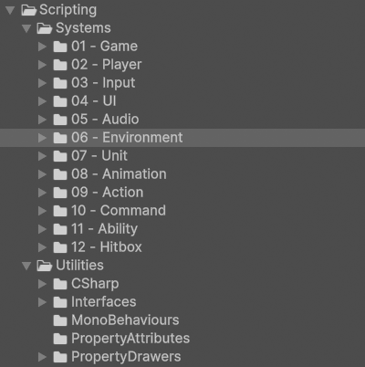
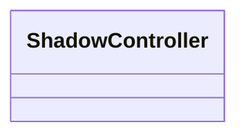
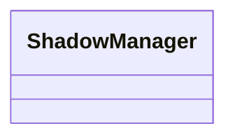

# Environment

!!! Summary

    This page summarizes all aspects of the environment system, which is responsible for building immersive and responsive worlds.

## Scripting

The code files in this section are at `Assets/Arcabidi/BeatEmUpTemplate/Scripting/Systems/06 - Environment`.

<figure markdown="span">
    
</figure>

### MonoBehaviours

These scripts are meant to be attached to GameObjects in the scene as components and inherit from Unity's [MonoBehaviour](https://docs.unity3d.com/6000.0/Documentation/Manual/class-MonoBehaviour.html) class.

#### BackgroundManagers

BackgroundManagers manage GameObjects that make up the background of a scene. This includes things like setting them active or inactive as needed.

`BackgroundManager.cs` manages the background GameObjects of the Title scene. It toggles its child GameObjects accordingly between the MainMenu and Options screens.

#### ShadowControllers

ShadowControllers control the logic of shadows. This includes things like changing their size and opacity based on their user's distance to a surface.

`ShadowController.cs` represents a basic, general-purpose ShadowController used by the template. This component can be found attached to the Shadow prefab. These prefabs are instantiated as children of the ShadowManager GameObject in the Training scene at runtime.

#### ShadowManagers

ShadowManagers manage the lifetimes of shadows. This includes things like registering and unregistering units to give them their own shadow.

`ShadowManager.cs` represents a basic, general-purpose ShadowManager used by the template. This component can be found attached to the ShadowManager GameObject in the Training scene.