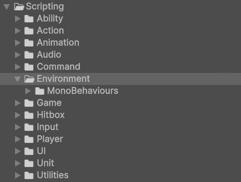

# Environment

!!! Summary

    This page summarizes all aspects of the environment system, which is responsible for creating dynamic game environments.

## Scripting

The code files in this section are at `Assets/_Project/Scripting/Systems/06 - Environment`.

<figure markdown="span">
    
</figure>

### MonoBehaviours

These scripts are meant to be attached to GameObjects in the scene as components and inherit from Unity's [MonoBehaviour](https://docs.unity3d.com/6000.0/Documentation/Manual/class-MonoBehaviour.html) class.

#### BackgroundManagers

BackgroundManagers manage GameObjects that make up the background of a scene. This includes things like setting them active or inactive as needed.

`BackgroundManager.cs` manages the background GameObjects of the Title scene. It toggles its child GameObjects accordingly between the MainMenu and Options screens