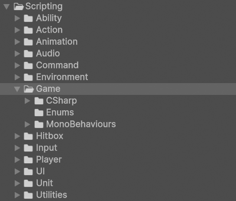

# Game

!!! Summary

    This page summarizes all aspects of the game system, which is responsible for changing the game's state and directing its flow.

## Scripting

The code files in this section are at `Assets/Arcabidi/BeatEmUpTemplate/Scripting/Systems/01 - Game`.

<figure markdown="span">
    
</figure>

### CSharp

These scripts are not meant to be attached to GameObjects in the scene. Many of them represent static event classes that are meant to be invoked, or are abstract classes representing concepts.

#### Constants

`Constants.cs` contains all the constants in the template.

#### GameEvents

`GameEvents.cs` contains all events related to general game management. Events in this class are invoked whenever you need to signal or direct gameflow on the game's highest level. This includes things like pausing, running, resetting, or exiting the game.

#### StageEvents

`StageEvents.cs` contains all events related to stage management. Events in the StageEvent class are invoked whenever you need to signal or direct gameflow on a stage level. This includes things like triggering a loss or a win.

!!! Note

    For this template we've defined stages as scenes where the main gameplay takes place. For now this is just the Training scene, but the stage designation also includes any future levels.

### Enums

These scripts contain groups of related constants that are meant to be used by other scripts. All classes in these folders use the `enum` keyword in their declaration.

#### Direction

`Direction.cs` enumerates the possible in-game directions in the template.

### MonoBehaviours

These scripts are meant to be attached to GameObjects in the scene as components and inherit from Unity's [MonoBehaviour](https://docs.unity3d.com/6000.0/Documentation/Manual/class-MonoBehaviour.html) class.

#### GameManagers

GameManagers control the changing state of the game.

`GameManager.cs` defines functionality common across all GameManagers, regardless of game. This includes a boolean that represents if a GameManager is currently in debug mode.

`PersistentGameManager.cs` defines game behaviour at the game level. This includes things like determining what to do when the game is reset or exited. This component can be found attached to the GameManager GameObject in the Persistent scene.

`StageGameManager.cs` defines game behaviour at the stage level. This includes things like determining what to do when the stage is paused, unpaused, or won. This component can be found attached to the GameManager object in the Training scene.

!!! Note

    For this template we've defined stages as scenes where the main gameplay takes place. For now this is just the Training scene, but the stage designation also includes any future levels.

#### SceneLoaders

SceneLoaders load and unload scenes.

`SceneLoader.cs` represents a basic, general-purpose SceneLoader used by the template. This component can be found attached to the SceneLoader GameObject in the Persistent scene.

#### UnitBehaviours

UnitBehaviours are components attached to a unit prefab that represents its functionality.

##### DirectionBehaviours

DirectionBehaviours describe the behaviour of a unit's [Direction](game.md#direction).

`DirectionBehaviour.cs` represents a basic, general-purpose DirectionBehaviour used by our template. This component can be found attached to the Human prefab and its Hero and Villain prefab variants. These prefabs are instantiated as children of the HumanPlayerUnitManager and AIPlayerUnitManager GameObjects in the Training scene at runtime.