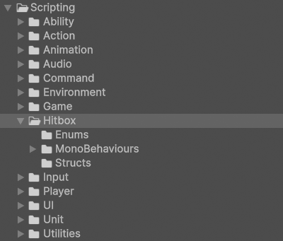

# Hitbox

!!! Summary

    This page summarizes all aspects of the hitbox system, which is responsible for transfering data between two bodies on collision.
    
## Scripting

All code files below are at `Assets/_Project/Scripting/Systems/12 - Hitbox`.

<figure markdown="span">
    
</figure>

### Enums

These scripts contain groups of related constants that are meant to be used by other scripts. All classes in these folders use the `enum` keyword in their declaration.

#### HurtboxMask

`HurtboxMask.cs` enumerates the possible HurtboxMasks a unit can have in the template. A unit's current HurtboxMask determines what [HurtboxTypes](#hurtboxtype) a unit interacts with.

#### HurtboxType

`HurtboxType.cs` enumerates the possible types a [Hurtbox](#hurtboxes) can have in the template. [Hitboxes](#hitboxes) only interact with Hurtboxes of specific types.

### MonoBehaviours

These scripts are meant to be attached to GameObjects in the scene as components and inherit from Unity's [MonoBehaviour](https://docs.unity3d.com/6000.0/Documentation/Manual/class-MonoBehaviour.html) class.

#### Hitboxes

Hitboxes represent areas of an [Ability](ability.md#abilities) that transmit data on collision with a [Hurtbox](#hurtboxes).

`Hitbox.cs` defines what is common across all Hitboxes, regardless of game. This includes things like performing a boxcast in order to get information about how the hit occured.

`JabHitbox.cs` defines the hitbox for the [Jab](ability.md#abilities) ability. This includes things like how it edits its [JabAbilityData](ability.md#abilitydata) using information about the hit and the target.

`CrossHitbox.cs` defines the hitbox for the [Cross](ability.md#abilities) ability. This includes things like how it edits its [CrossAbilityData](ability.md#abilitydata) using information about the hit and the target.

#### HitDataEditors

HitDataEditors allow the user of an [Ability](ability.md#abilities) a chance to edit its [AbilityData](ability.md#abilitydata) pre and post hit.

`HitDataEditor.cs` represents a basic, general-purpose HitDataEditor used by the template. This component can be found attached to the Hitboxes GameObject under the Human prefab and its Hero and Villain prefab variants.

#### HitResponders

HitResponders respond when a unit's [Hitbox](#hitboxes) triggers a collision with a [Hurtbox](#hurtboxes).

`HitResponder.cs` represents a basic, general-purpose HitResponder used by the template. This component can be found attached to the Hitboxes GameObject under the Human prefab and its Hero and Villain prefab variants.

#### Hurtboxes

Hurtboxes represent areas that trigger collisions with [Hitboxes](#hitboxes).

`Hurtbox.cs` defines what is common across all Hurtboxes, regardless of game. This includes things like having a class field that represents its [HurtboxType](#hurtboxtype).

#### HurtDataEditors

HurtDataEditors allow the target of an [Ability](ability.md#abilities) a chance to edit its [AbilityData](ability.md#abilitydata) post hit.

`HurtDataEditor.cs` represents a basic, general-purpose HurtDataEditor used by our template. This component can be found attached to the Hurtboxes GameObject under the Human prefab and its Hero and Villain prefab variants.

#### HurtResponders

HurtResponders respond when a unit's [Hurtbox](#hurtboxes) triggers a collision with a [Hitbox](#hitboxes).

`HurtResponder.cs` represents a basic, general-purpose HurtResponder used by our template. This component can be found attached to the Hurtboxes GameObject under the Human prefab and its Hero and Villain prefab variants.

#### UnitBehaviours

UnitBehaviours are components attached to a unit prefab that represents its functionality.

##### HurtboxMaskBehaviours

HurtboxMaskBehaviours describe the behaviour of a unit's [HurtboxMask](#hurtboxmask).

`HurtboxMaskBehaviour.cs` represents a basic, general-purpose HurtboxMaskBehaviour used by our template. This component can be found attached to the Human prefab and its Hero and Villain prefab variants. These prefabs are instantiated as children of the HumanPlayerUnitManager and AIPlayerUnitManager GameObjects in the Training scene at runtime.

### Structs

These scripts contain user-defined data types that combine fields of different types underneath a single type. All classes in this folder use the `struct` keyword in their declaration.

#### HitPacket

`HitPacket.cs` contains all the information involved in a hit, including the [AbilityData](ability.md#abilitydata) being transferred.
