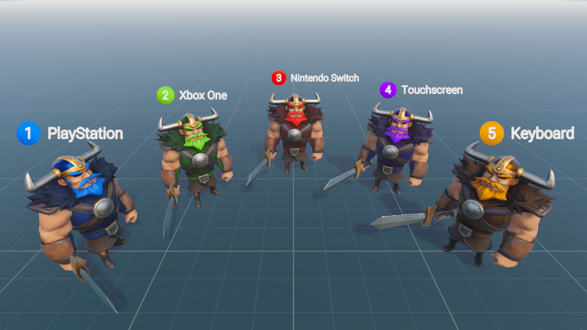

# Input

!!! Summary

    This section summarizes all aspects of the input system, which is responsible for switching between different control schemes.
    
## Design decisions

Unity’s legacy input system is called the Input Manager. It is built into the Editor and is part of the core Unity platform. It is enabled by default.

!!! Warning

    Unity currently recommends using the new Input System package since they plan on removing the legacy Input Manager in the future.

In 2020 Unity released a new input system called the Input System Package. It is more flexible than the basic Input Manager as it allows any kind of Input Device to control Unity content. It must be installed manually through the Package Manager, after which it can either deactivate the older Input Manager or work alongside it.

<figure markdown="span">
    
</figure>

 This template uses Unity's new Input System package. See Unity’s example project ‘Warriors’ for a full demonstration of the new Input System’s tools and functionality. 
 
[Warriors (Input System sample)](https://unity.com/blog/technology/learn-the-input-system-with-updated-tutorials-and-our-sample-project-warriors)

<figure markdown="span">
    
</figure>

## Scripting

### CSharp

#### InputEvents

InputEvents contain all events related to input.

`InputEvents.cs` contains all events related to general input. Events in this class are invoked to signal when they occur. This includes things like enabling or disabling all or specific player input action maps.

`TitleInputEvents.cs` contains all events related to input on the title screen. Events in this class are invoked to signal when they occur. This includes things like notifying other classes when the keybinding process has started or completed.

### Enums

#### ActionMap

`ActionMap.cs` enumerates all Action Maps in the [InputActionAsset](#inputactionasset) being used by players.

### MonoBehaviours

#### InputActionMapControllers

InputActionMapControllers control the behaviour of PlayerInput action maps within a scene.

`InputActionMapController.cs` defines what is common across all InputActionMapControllers, regardless of game. This includes things like keeping a data structure of all PlayerManagers that the controller can modify.

`BootInputActionMapController.cs` defines InputActionMapController behaviour unique to the Boot scene. This includes things like enabling or disabling maps when a player joins or the Title scene finishes preloading. This component can be found attached to the InputActionMapController GameObject in the Boot scene.

`TitleInputActionMapController.cs` defines InputActionMapController behaviour unique to the Title scene. Things includes things like rebinding keys from the Options menu. This component can be found attached to the InputActionMapController GameObject in the Title scene.

`StageInputActionMapController.cs` defines InputActionMapController behaviour unique to Stage scenes. For this template we've defined stages as scenes where the main gameplay takes place. For now this is just the Training scene, but the stage designation also includes any future levels. It can do things like enable or disable maps on stage win, lose, continue, game over, and win. This component can be found attached to the InputActionMapController GameObject in the Stage scene.

## Unity

### InputSystem

#### InputActionAsset

`Controls.inputactions` is the 

#### InputSettings

`InputSystem.inputsettings.asset` is the 