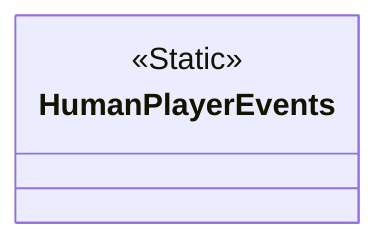
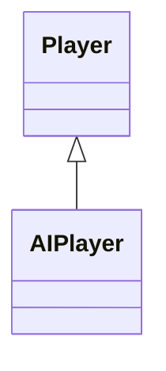
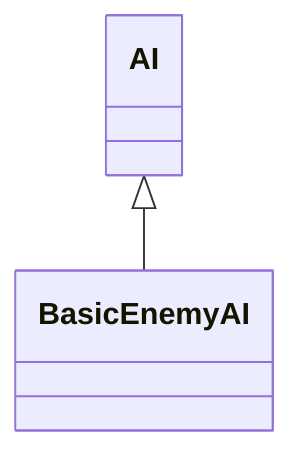
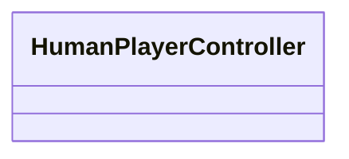
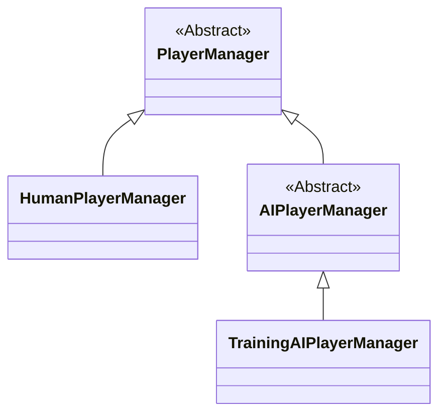

# Player

!!! Summary

    This section summarizes all aspects of the player system, which is responsible for managing human and AI players.

## Design decisions

Unity's local player system is managed through their Input System package by a component called the Player Input Manager. It automatically manages the creation and lifetime of PlayerInput instances as players join and leave the game.

<figure markdown="span">
    
</figure>

For this template we have opted not to use Unity's default Player Input Manager component. This is because the default component only allows us to define one prefab for Players when we want our Player system to be able to create different prefabs for humans and AIs.

We have created our own custom Player managers for this purpose. Virtual devices are created for AI players so that their inputs can be handled the same way as human players. See the [PlayerManagers](#playermanagers) section below for more information. 

## Scripting

### CSharp

#### HumanPlayerEvents

`HumanPlayerEvents.cs` contains all events related to human players. Events in this class are invoked to signal when they occur. This includes things like joining the game, pressing any key, clicking, or toggling pause.

#### Players

Players represent entites capable of playing the game by giving it inputs.

`Player.cs` defines what is common across all players regardless of game or whether they are human or AI. This includes things like having an assigned ID and a reference to their assigned PlayerInput component.

`AIPlayer.cs` defines what is unique to AI players, regardless of game. This includes a reference to the AI component that controls their logic.

### MonoBehaviours

#### AIs

AIs are components attached to AIPlayer prefabs that determine how the AI plays the game.

`AI.cs` defines what is common across all AI, regardless of game and whether they are enemies or allies. This includes assigning its PlayerInput and UnitController components.

`BasicEnemyAI.cs` represents a basic enemy AI that moves to the closest human player unit and performs a basic attack. This component can be found attached to AIPlayer prefab. These prefabs are instantiated as children of the AIPlayerManager GameObject in the Training scene at runtime.

#### HumanPlayerControllers

HumanPlayerControllers are scripts attached to HumanPlayer prefabs that determine what HumanPlayerEvents are invoked when that human player performs a specific input action.

`HumanPlayerController.cs` represents a basic human player controller. This component can be found attached to the HumanPlayer prefab. These prefabs are instantiated as children of the HumanPlayerManager GameObject in the Persistent scene at runtime.

#### PlayerManagers

PlayerManagers are custom scripts that manage human and AI players, replacing Unity's default Player Input Manager component.

`PlayerManager.cs` defines what is common across all PlayerManagers, regardless of game. This includes things like maintaining a data structure for the players and defining the maximum player count. 

`HumanPlayerManager.cs` defines what is common across all PlayerManagers that manage only humans. This includes detecting the usage of unpaired devices and adding a new human player. This component can be found attached to the HumanPlayerManager GameObject in the Persistent scene.

`AIPlayerManager.cs` defines what is common across all PlayerManagers that manage only AI. This includes creating virtual devices for AI players to use when adding them.

`TrainingAIPlayerManager.cs` defines the AIPlayerManager behaviour at the training level. This includes spawning AI player units on Awake() and stopping them when the stage is lost. This component can be found attached to the AIPlayerManager GameObject in the Training scene.