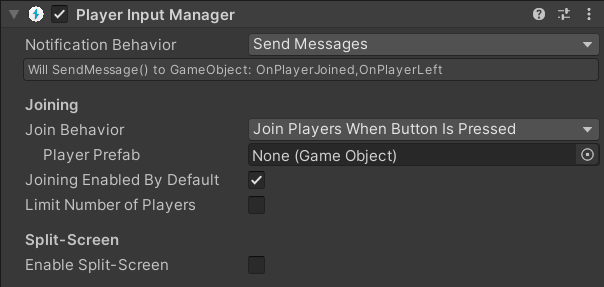
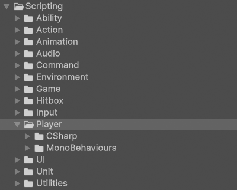
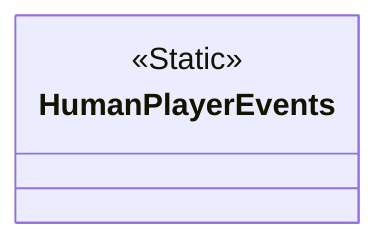
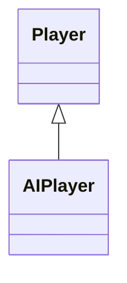
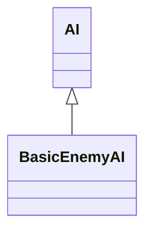
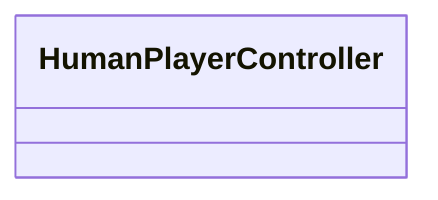
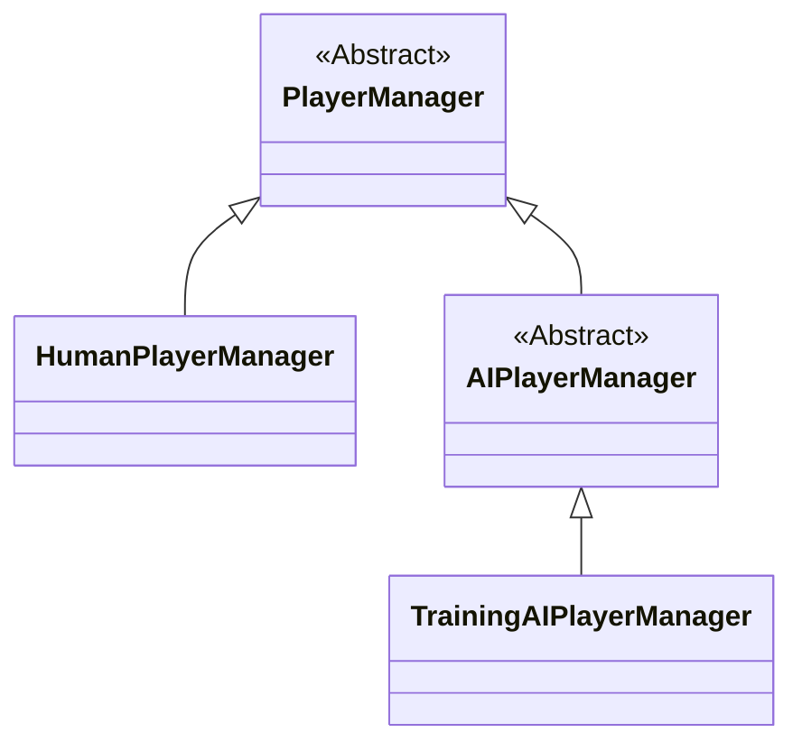

# Player

!!! Summary

    This page summarizes all aspects of the player system, which is responsible for managing both human and AI players.

## Design decisions

This template makes the following design decisions regarding the default way Unity handles players:

### Player system

Unity's local player system is managed through their Input System package by a component called the [Player Input Manager](https://docs.unity3d.com/Packages/com.unity.inputsystem@1.13/manual/PlayerInputManager.html). It automatically manages the creation and lifetime of [PlayerInput](https://docs.unity3d.com/Packages/com.unity.inputsystem@1.13/manual/PlayerInput.html) instances as players join and leave the game.

<figure markdown="span">
    
</figure>

For this template we have opted not to use Unity's default Player Input Manager component. This is because we want our human players and AI players to be handled separately. This template uses [custom PlayerManagers](#playermanagers) for this purpose. Virtual devices are created for AI players so that their inputs can be handled the same way as human players.

## Scripting

The code files in this section are at `Assets/Arcabidi/BeatEmUpTemplate/Scripting/Systems/02 - Player`.

<figure markdown="span">
    
</figure>

### CSharp

These scripts are not meant to be attached to GameObjects in the scene. Many of them represent static event classes that are meant to be invoked, or are abstract classes representing concepts.

#### HumanPlayerEvents

`HumanPlayerEvents.cs` contains all events related to human players. This includes things like joining the game, pressing any key, clicking, or toggling pause.

#### Players

Players represent entities capable of playing the game by giving it inputs. This includes both human players and AI players.

`Player.cs` defines what is common across all players regardless of game or whether they are human or AI. This includes things like having an assigned ID and a reference to their assigned PlayerInput component.

`AIPlayer.cs` defines what is unique to AI players, regardless of game. This includes a reference to the AI component that controls their logic.

### MonoBehaviours

These scripts are meant to be attached to GameObjects in the scene as components and inherit from Unity's [MonoBehaviour](https://docs.unity3d.com/6000.0/Documentation/Manual/class-MonoBehaviour.html) class.

#### AIs

AIs are components attached to AIPlayer prefabs that determine how they play the game.

`AI.cs` defines what is common across all AI regardless of game and whether they are enemies or allies. This includes things like assigning its [PlayerInput](https://docs.unity3d.com/Packages/com.unity.inputsystem@1.13/manual/PlayerInput.html) and [UnitController](unit.md#unitcontrollers) components.

`BasicEnemyAI.cs` represents a basic enemy AI that moves to the closest human player unit and performs a basic attack. It repeats this behaviour until there are no more targets left or it is defeated. This component can be found attached to AIPlayer prefab. These prefabs are instantiated as children of the AIPlayerManager GameObject in the Training scene at runtime.

#### HumanPlayerControllers

HumanPlayerControllers determine what [HumanPlayerEvents](#humanplayerevents) are invoked when that human player performs a specific input action.

`HumanPlayerController.cs` represents a basic human player controller. This component can be found attached to the HumanPlayer prefab. These prefabs are instantiated as children of the HumanPlayerManager GameObject in the Persistent scene at runtime.

#### PlayerManagers

PlayerManagers are custom scripts that manage human and AI [Players](#players), replacing Unity's default [Player Input Manager](https://docs.unity3d.com/Packages/com.unity.inputsystem@1.13/manual/PlayerInputManager.html) component.

`PlayerManager.cs` defines what is common across all PlayerManagers, regardless of game. This includes things like maintaining a data structure for the players and defining the maximum number of players it can manage.

`HumanPlayerManager.cs` defines what is common across all PlayerManagers that manage only humans. This includes detecting the usage of unpaired devices and adding a new human player. This component can be found attached to the HumanPlayerManager GameObject in the Persistent scene.

`AIPlayerManager.cs` defines what is common across all PlayerManagers that manage only AI. This includes creating virtual devices for AI players to use when adding them.

`TrainingAIPlayerManager.cs` defines AIPlayerManager behaviour unique to the Training scene. This includes spawning AI player units on Awake() and stopping them [when the stage is lost](game.md#stageevents). This component can be found attached to the AIPlayerManager GameObject in the Training scene.