# User Interface (UI)

!!! Summary

    This section summarizes all aspects of the user interface (UI) system, which is responsible for creating custom screens and transitioning between them.

## Design decisions

Unity UI (uGUI) is one of Unity’s core packages. It is a GameObject-based UI system that uses Components and the Game View to arrange, position, and style user interfaces. Because it is a runtime-GUI system it cannot be used to create or change user interfaces in the Unity Editor.

!!! Warning

    Unity currently recommends using UIToolkit since they plan on removing the legacy uGUI in the future.

In 2021 Unity released a new UI system called UI Toolkit. Inspired by standard web technologies, it was designed to be used by anyone who has experience developing web pages or applications since the knowledge is transferable and the core concepts are familiar. Unlike uGUI, UI Toolkit can create both runtime and Editor UI.  

!!! Info

    The current release of UI Toolkit does not have some features that uGUI can still support. Some older, legacy projects may also still use uGUI. Check out Unity's official [comparison of the two UI systems](https://docs.unity3d.com/Manual/UI-system-compare.html).

This template uses Unity's new UI Toolkit system. See Unity’s sample projects [QuizU](https://assetstore.unity.com/packages/essentials/tutorial-projects/quizu-a-ui-toolkit-sample-268492) and [Dragon Crashers](https://assetstore.unity.com/packages/essentials/tutorial-projects/dragon-crashers-ui-toolkit-sample-project-231178) for a full demonstration of UI Toolkit's tools and functionality. 

<figure markdown="span">
    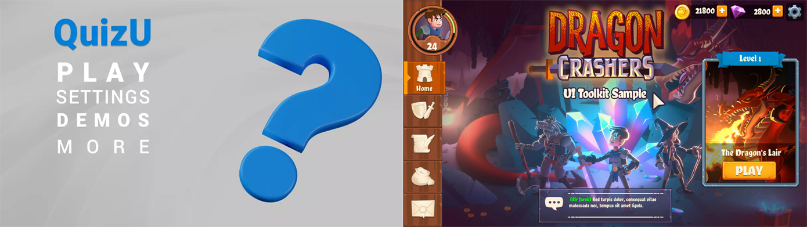
</figure>

## Scripting

All code files below are located at `Assets/_Project/Scripting/Systems/04 - UI`.

### CSharp

These scripts are not meant to be attached to GameObjects in the scene. Many of them represent static event classes that are meant to be invoked, or are abstract classes representing concepts.

#### UIEvents

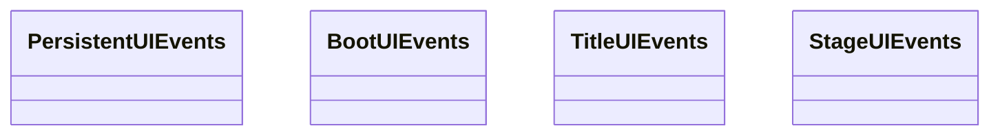

UIEvents contain all events related to the user interface.

`PersistentUIEvents.cs` contains all UIEvents unique to the Peristent scene. This includes things like fade transitions, which exist on the persistent level and can be invoked from any scene. 

`BootUIEvents.cs` contains all UIEvents unique to the Boot scene. This includes things like signaling when the Company Logo video player has been prepared or when the Title scene has been successfully preloaded.

`TitleUIEvents.cs` contains all UIEvents unique to the Title scene. This includes things like signaling when menu options are moused over or clicked.

`StageUIEvents.cs` contains all UIEvents unique to Stage scenes. This includes things like showing the pause screen or updating player health bars.

!!! Note

    For this template we've defined stages as scenes where the main gameplay takes place. For now this is just the Training scene, but the stage designation also includes any future levels.

#### UIViews

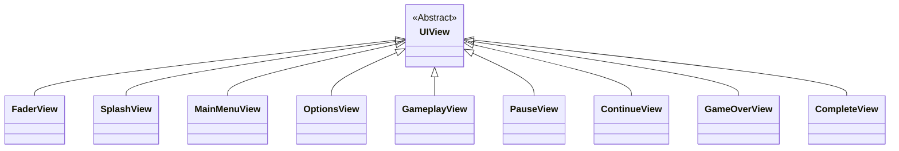

UIViews contain the various VisualElements that make up the user interface for each screen. They work closely with their respective ScreenController and UIEvents classes to create an interactive user interface.

| 
 UIView | Represents | Used by | Works with | Using |
| ---------------: | :-------------- | :-------------- | :-------------- | :-------------- |
| `FaderView` | Fader screen | Persistent scene | FaderScreenController | PersistentUIEvents |
| `SplashView` | Splash screen | Boot scene | SplashScreenController | BootUIEvents |
| `MainMenuView` | MainMenu screen | Title scene | MainMenuScreenController | TitleUIEvents |
| `OptionsView` | Options screen | Title scene | OptionsScreenController | TitleUIEvents |
| `GameplayView` | Gameplay screen | 'Stage' scenes | GameplayScreenController | StageUIEvents |
| `PauseView` | Pause screen | 'Stage' scenes | PauseScreenController | StageUIEvents |
| `ContinueView` | Continue screen | 'Stage' scenes | ContinueScreenController | StageUIEvents |
| `GameOverView` | GameOver screen | 'Stage' scenes | GameOverScreenController | StageUIEvents |
| `CompleteView` | Complete screen | 'Stage' scenes | CompleteScreenController | StageUIEvents |

!!! Note

    For this template we've defined stages as scenes where the main gameplay takes place. For now this is just the Training scene, but the stage designation also includes any future levels.

### MonoBehaviours

These scripts are meant to be attached to GameObjects in the scene as components and inherit from Unity's [MonoBehaviour](https://docs.unity3d.com/6000.0/Documentation/Manual/class-MonoBehaviour.html) class.

#### CursorControllers

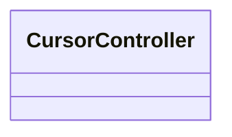

#### FloatingHealthBarControllers

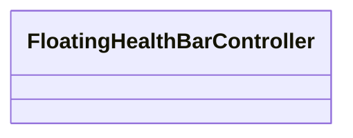

#### FloatingHealthBarManagers

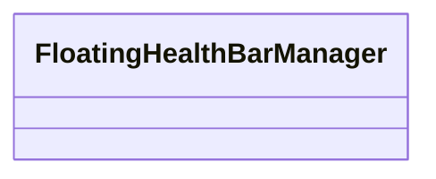

#### ScreenControllers

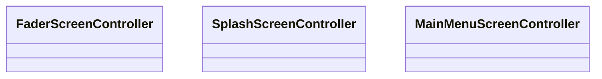
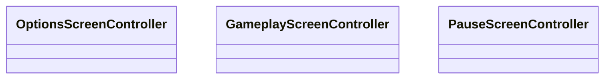
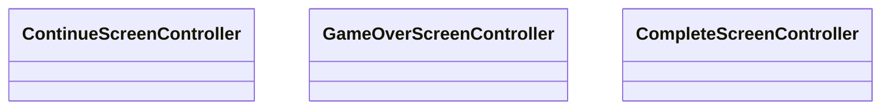

ScreenControllers control the logic of a screen used by a scene. They work closely with their respective UIView and UIEvents classes to create an interactive user interface.

| 
 UIView | Controls logic for | Used by | Works with | Using |
| ---------------: | :-------------- | :-------------- | :-------------- | :-------------- |
| `FaderScreenController` | Fader screen | Persistent scene | FaderView | PersistentUIEvents |
| `SplashScreenController` | Splash screen | Boot scene | SplashView | BootUIEvents |
| `MainMenuScreenController` | MainMenu screen | Title scene | MainMenuView | TitleUIEvents |
| `OptionsScreenController` | Options screen | Title scene | OptionsView | TitleUIEvents |
| `GameplayScreenController` | Gameplay screen | 'Stage' scenes | GameplayView | StageUIEvents |
| `PauseScreenController` | Pause screen | 'Stage' scenes | PauseView | StageUIEvents |
| `ContinueScreenController` | Continue screen | 'Stage' scenes | ContinueView | StageUIEvents |
| `GameOverScreenController` | GameOver screen | 'Stage' scenes | GameOverView | StageUIEvents |
| `CompleteScreenController` | Complete screen | 'Stage' scenes | CompleteView | StageUIEvents |

!!! Note

    For this template we've defined stages as scenes where the main gameplay takes place. For now this is just the Training scene, but the stage designation also includes any future levels.

#### UIManagers

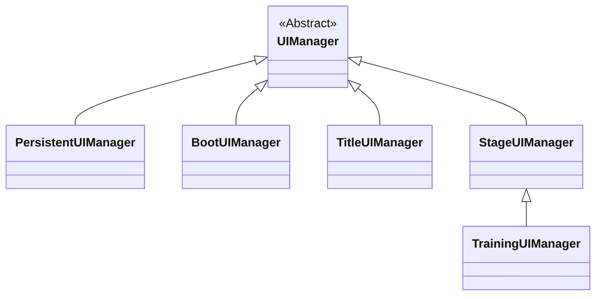

### VisualElements

#### HealthBar

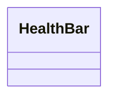

## Unity

All non-code files below are located at `Assets/_Project/Unity/UI`.

### UI Toolkit

#### Fonts

#### RuntimeUI

#### ThemeStyleSheets

#### VisualTrees