# User Interface (UI)

!!! Summary

    This section summarizes all aspects of the user interface (UI) system, which is responsible for creating custom screens and transitioning between them.

## Design decisions

Unity UI (uGUI) is one of Unity’s core packages. It is a GameObject-based UI system that uses Components and the Game View to arrange, position, and style user interfaces. Because it is a runtime-GUI system it cannot be used to create or change user interfaces in the Unity Editor.

In 2021 Unity released a new UI system called UI Toolkit. Inspired by standard web technologies, it was designed to be used by anyone who has experience developing web pages or applications since the knowledge is transferable and the core concepts are familiar. Unlike uGUI, UI Toolkit can create both runtime and Editor UI. The current release of UI Toolkit, however, does not have some features that uGUI can still support. Some older, legacy projects may also still use uGUI. 
 
[Comparison of UI systems in Unity](https://docs.unity3d.com/Manual/UI-system-compare.html) 
 

!!! Warning

    Unity currently recommends using UIToolkit since they plan on removing the legacy uGUI in the future.
 
[QuizU - A UI toolkit sample](https://assetstore.unity.com/packages/essentials/tutorial-projects/quizu-a-ui-toolkit-sample-268492)

<figure markdown="span">
    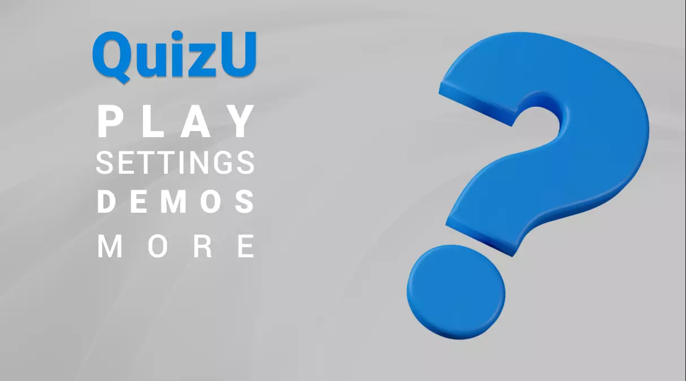
</figure>

[Dragon Crashers - UI Toolkit Sample project](https://assetstore.unity.com/packages/essentials/tutorial-projects/dragon-crashers-ui-toolkit-sample-project-231178)

<figure markdown="span">
    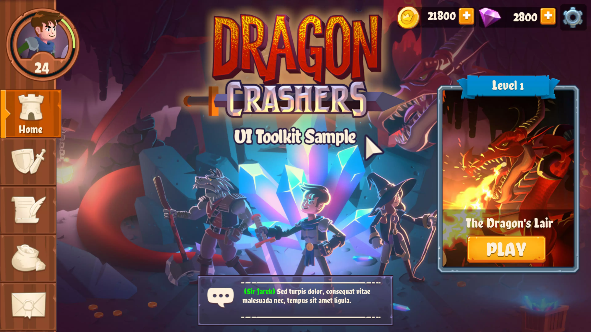
</figure>

## Scripting

### CSharp

#### UIEvents

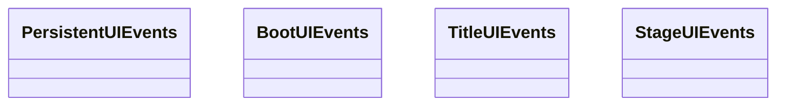

#### UIViews

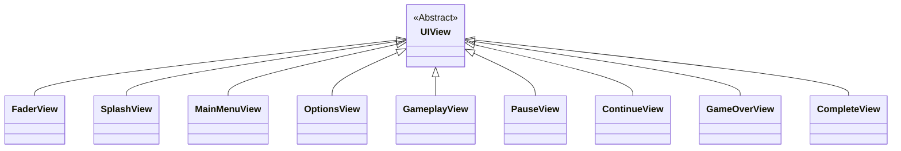

### MonoBehaviours

#### CursorControllers

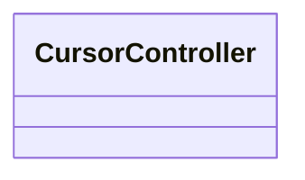

#### FloatingHealthBarControllers

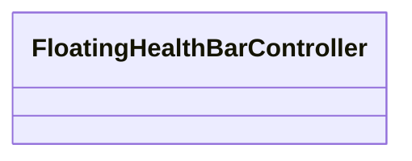

#### FloatingHealthBarManagers

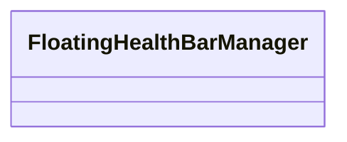

#### ScreenControllers

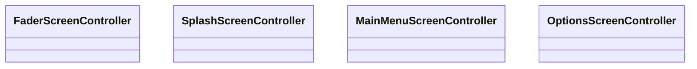
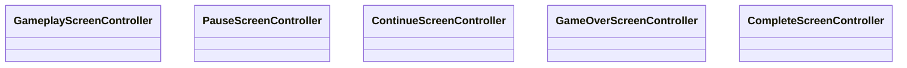

#### UIManagers

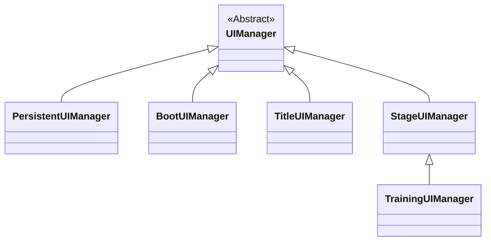

### VisualElements

#### HealthBar

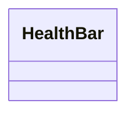

## Unity

### UI Toolkit

#### Fonts

#### RuntimeUI

#### ThemeStyleSheets

#### VisualTrees