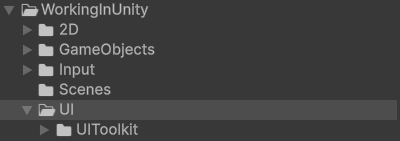
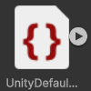

# User Interface (UI)

!!! Summary

    This page summarizes all aspects of the user interface (UI) system, which is responsible for creating custom screens and transitioning between them.

## Design decisions

This template makes the following design decisions regarding the default way Unity handles UI:

### UI system

[Unity UI (uGUI)](https://docs.unity3d.com/Packages/com.unity.ugui@3.0/manual/index.html) is one of Unity’s core packages. It is a GameObject-based UI system that uses Components and the Game View to arrange, position, and style user interfaces. Because it is a runtime-GUI system it cannot be used to create or change user interfaces in the Unity Editor.

In 2021 Unity released a new UI system called [UI Toolkit](https://docs.unity3d.com/Manual/UIElements.html). Inspired by standard web technologies, it was designed to be used by anyone who has experience developing web pages or applications since the knowledge is transferable and the core concepts are familiar. Unlike uGUI, UI Toolkit can create both runtime and Editor UI.  

!!! Warning

    Unity currently [recommends using UIToolkit](https://docs.unity3d.com/Manual/UI-system-compare.html#:~:text=UI%20Toolkit%20is%20intended%20to%20become%20the%20recommended%20UI%20system%20for%20your%20new%20UI%20development%20projects) since they plan on removing the legacy uGUI in the future.

!!! Info

    The current release of UI Toolkit does not have some features that uGUI can still support. Some older, legacy projects may also still use uGUI. Check out Unity's official [comparison of the two UI systems](https://docs.unity3d.com/Manual/UI-system-compare.html).

This template uses Unity's new UI Toolkit system. See Unity’s sample projects [QuizU](https://assetstore.unity.com/packages/essentials/tutorial-projects/quizu-a-ui-toolkit-sample-268492) and [Dragon Crashers](https://assetstore.unity.com/packages/essentials/tutorial-projects/dragon-crashers-ui-toolkit-sample-project-231178) for a full demonstration of UI Toolkit's tools and functionality. 

<figure markdown="span">
    
</figure>

### Cursor

In Unity the default hardware cursor can be set at `Edit > Project Settings > Player` where a custom Texture 2D can be assigned. It can then be controlled using Unity's built-in [Cursor API](https://docs.unity3d.com/6000.0/Documentation/ScriptReference/Cursor.html). This sprite, however, cannot be scaled dynamically and is limited to a dimension of 32x32 on Windows.

To change this we have created our own [custom CursorController](#cursorcontrollers). It is a software cursor (so it will lag slightly behind compared to the default hardware cursor) that can scale dynamically and has no size limit.

## UI folder

The non-code files in this section are at `Assets/_Project/WorkingInUnity/UI`.

<figure markdown="span">
    
</figure>

### UI Toolkit

The non-code files in this section are in the `UIToolkit` subfolder.

#### Fonts

<figure markdown="span">
    
</figure>

Each font subfolder contains its license, its font, and its [font assets](https://docs.unity3d.com/6000.0/Documentation/Manual/UIE-font-asset.html). Font assets act as containers for fonts so that they can serve as the basis for variations without changing the original font.

This template only uses one font: [`PressStart2P-Regular.ttf`](https://fonts.google.com/specimen/Press+Start+2P).

#### PanelSettings

<figure markdown="span">
    
</figure>

[PanelSettings](https://docs.unity3d.com/Packages/com.unity.ui@1.0/api/UnityEngine.UIElements.PanelSettings.html) assets instantiate panels at runtime, where Unity displays UXML-file based UI in the Game view. [UIDocument](https://docs.unity3d.com/6000.0/Documentation/ScriptReference/UIElements.UIDocument.html) components need a reference to a PanelSettings asset so that they know which panel to display their content on.

`UIPanelSettings.asset` defines the bottom panel, which is used for [UIViews](#uiviews) and the great majority of the user interface. It is referenced by the UIDocument component on the UIManager GameObject in the Boot, TItle, and Training scenes.

`CursorPanelSettings.asset` defines the middle panel, which is used for the mouse cursor that exists above the UI but below screen transitions. It is referenced by the UIDocument component on the Cursor GameObject in the Persistent scene.

`PersistentPanelSettings.asset` defines the top panel, which is used for screen transitions. It is referenced by the UIDocument component on the UIManager GameObject in the Persistent scene.

#### ThemeStyleSheets

<figure markdown="span">
    
</figure>

 [ThemeStyleSheet](https://docs.unity3d.com/6000.0/Documentation/Manual/UIE-tss.html) files are USS files that Unity uses for management purposes. They are referenced by PanelSettings assets and applied to their panels.

`UnityDefaultRuntimeTheme.tss` is the default ThemeStyleSheet that is automatically created by Unity when the first [UIDocument](https://docs.unity3d.com/6000.0/Documentation/ScriptReference/UIElements.UIDocument.html) is added to a GameObject.

#### VisualTrees

[VisualTree](https://docs.unity3d.com/6000.0/Documentation/Manual/UIE-VisualTree.html) files depict hierarchy relationships between VisualElements. They can represent scenes, screens, or even custom VisualElements themselves. VisualTrees are created via `Assets > Create > UI Toolkit > UI Document`.

When a VisualTree is created in UIBuilder it automatically generates the underlying [Unity Extensible Markup Language (UXML)](https://docs.unity3d.com/6000.0/Documentation/Manual/UIE-USS.html) and [UnityStyleSheet (USS)](https://docs.unity3d.com/6000.0/Documentation/Manual/UIE-USS.html) code while providing a preview for reference. UXML and USS are UIToolkit equivalents to HTML and CSS in web design and have similar functionality by design.

VisualTrees representing entire scenes are referenced by the [UIDocument](https://docs.unity3d.com/6000.0/Documentation/ScriptReference/UIElements.UIDocument.html) component on the UIManager GameObject in the Persistent, Boot, TItle, and Training scenes.

## Scripting

The code files in this section are at `Assets/_Project/Scripting/Systems/04 - UI`.

<figure markdown="span">
    
</figure>

### CSharp

These scripts are not meant to be attached to GameObjects in the scene. Many of them represent static event classes that are meant to be invoked, or are abstract classes representing concepts.

#### UIEvents

UIEvents contain all events related to the user interface.

`PersistentUIEvents.cs` contains all UIEvents unique to the Persistent scene. This includes things like fade transitions which exist on the persistent level and can be invoked from any scene. 

`BootUIEvents.cs` contains all UIEvents unique to the Boot scene. This includes things like signaling when the Company Logo video player has been prepared or when the Title scene has been successfully preloaded.

`TitleUIEvents.cs` contains all UIEvents unique to the Title scene. This includes things like signaling when menu options are moused over or clicked.

`StageUIEvents.cs` contains all UIEvents unique to Stage scenes. This includes things like showing the pause screen or updating player health bars.

!!! Note

    For this template we've defined stages as scenes where the main gameplay takes place. For now this is just the Training scene, but the stage designation also includes any future levels.

#### UIViews

UIViews contain the various [VisualElements](#visualelements) that make up the user interface for each screen. They communicate with their respective [ScreenController](#screencontrollers) using [UIEvents](#uievents) classes to create an interactive user interface.

| 
 UIView | Represents | Used by | Works with | Using |
| ---------------: | :-------------- | :-------------- | :-------------- | :-------------- |
| `FaderView` | Fader screen | Persistent scene | FaderScreenController | PersistentUIEvents |
| `SplashView` | Splash screen | Boot scene | SplashScreenController | BootUIEvents |
| `MainMenuView` | MainMenu screen | Title scene | MainMenuScreenController | TitleUIEvents |
| `OptionsView` | Options screen | Title scene | OptionsScreenController | TitleUIEvents |
| `GameplayView` | Gameplay screen | Stage scenes | GameplayScreenController | StageUIEvents |
| `PauseView` | Pause screen | Stage scenes | PauseScreenController | StageUIEvents |
| `ContinueView` | Continue screen | Stage scenes | ContinueScreenController | StageUIEvents |
| `GameOverView` | GameOver screen | Stage scenes | GameOverScreenController | StageUIEvents |
| `CompleteView` | Complete screen | Stage scenes | CompleteScreenController | StageUIEvents |

!!! Note

    For this template we've defined stages as scenes where the main gameplay takes place. For now this is just the Training scene, but the stage designation also includes any future levels.

### MonoBehaviours

These scripts are meant to be attached to GameObjects in the scene as components and inherit from Unity's [MonoBehaviour](https://docs.unity3d.com/6000.0/Documentation/Manual/class-MonoBehaviour.html) class.

#### CursorControllers

CursorControllers control the logic of the software cursor sprite. This includes things like dynamically updating its position, size, and visibility.

`CursorController.cs` represents a basic, general-purpose CursorController used by the template. This component can be found attached to the Cursor GameObject in the Persistent scene.

#### FloatingHealthBarControllers

FloatingHealthBarControllers control the logic of floating health bars. This includes things like updating the floating health bar's position to follow a specific unit.

`FloatingHealthBarController.cs` represents a basic, general-purpose FloatingHealthBarController used by the template. This component can be found attached to the FloatingHealthBar prefab. These prefabs are instantiated as children of the FloatingHealthBarManager GameObject in the Training scene at runtime.

#### FloatingHealthBarManagers

FloatingHealthBarManagers manage the lifetimes of floating health bars. This includes things like registering and unregistering units to give them their own floating health bar.

`FloatingHealthBarManager.cs` represents a basic, general-purpose FloatingHealthBarManager used by the template. This component can be found attached to FloatingHealthBarManager GameObject in the Training scene.

#### ScreenControllers

ScreenControllers control the logic of a screen used by a scene. This includes things like determining what happens when a specific button is clicked. They communicate with their respective [UIView](#uiviews) using [UIEvents](#uievents) classes to create an interactive user interface. These components can be found attached to GameObjects of the same name that are children of the ScreenControllers GameObject in their respective scenes.

| 
 UIView | Controls logic for | Used by | Works with | Using |
| ---------------: | :-------------- | :-------------- | :-------------- | :-------------- |
| `FaderScreenController` | Fader screen | Persistent scene | FaderView | PersistentUIEvents |
| `SplashScreenController` | Splash screen | Boot scene | SplashView | BootUIEvents |
| `MainMenuScreenController` | MainMenu screen | Title scene | MainMenuView | TitleUIEvents |
| `OptionsScreenController` | Options screen | Title scene | OptionsView | TitleUIEvents |
| `GameplayScreenController` | Gameplay screen | Stage scenes | GameplayView | StageUIEvents |
| `PauseScreenController` | Pause screen | Stage scenes | PauseView | StageUIEvents |
| `ContinueScreenController` | Continue screen | Stage scenes | ContinueView | StageUIEvents |
| `GameOverScreenController` | GameOver screen | Stage scenes | GameOverView | StageUIEvents |
| `CompleteScreenController` | Complete screen | Stage scenes | CompleteView | StageUIEvents |

!!! Note

    For this template we've defined stages as scenes where the main gameplay takes place. For now this is just the Training scene, but the stage designation also includes any future levels.

#### UIManagers

UIManagers manage the lifetimes of [UIViews](#uiviews) within a scene. This includes things like creating, showing, and hiding screens when needed.

`UIManager.cs` defines what is common across all UIManagers, regardless of game. This includes things like referencing a [UIDocument](https://docs.unity3d.com/6000.0/Documentation/ScriptReference/UIElements.UIDocument.html) or maintaining a data structure that contains all the UIViews its managing.

`PersistentUIManager.cs` defines UIManager behaviour unique to the Persistent scene, like showing the Fader screen for fade-from or fade-to transitions. This component can be found attached to the UIManager GameObject in the Persistent scene.

`BootUIManager.cs` defines UIManager behaviour unique to the Boot scene, like showing the Splash screen by default. This component can be found attached to the UIManager GameObject in the Boot scene.

`TitleUIManager.cs` defines UIManager behaviour unique to the Title scene, like toggling between the MainMenu screen and the Options screen. This component can be found attached to the UIManager GameObject in the Title scene.

`StageUIManager.cs` defines UIManager behaviour unique to stage scenes, like showing the Gameplay screen by default or toggling between the Pause, Continue, GameOver and Complete screens.

`TrainingUIManager.cs` defines UIManager behaviour unique to the Training scene, like changing the text color in the footer to suit the background. This component can be found attached to the UIManager GameObject in the Training scene.

!!! Note

    For this template we've defined stages as scenes where the main gameplay takes place. For now this is just the Training scene, but the stage designation also includes any future levels.

### VisualElements

These scripts contain objects that are part of the UIElements visual tree and inherit from Unity's base [VisualElement](https://docs.unity3d.com/6000.0/Documentation/ScriptReference/UIElements.VisualElement.html) class.

#### HealthBar

`HealthBar.cs` is a custom VisualElement that represents a unit's health. The size of its foreground element relative to its background element visually indicates a unit's current health relative to its maximum health. It can fill either horizontally or vertically.