# Animation

!!! Summary

    This page summarizes all aspects of the animation system, which is responsible for bringing objects in the scene to life.

## Design decisions

This template makes the following design decisions regarding the default way Unity handles animation:

### Animation system

This project uses Unity's default built-in animation system, known as the [Mecanim Animation system](https://docs.unity3d.com/Manual/AnimationOverview.html), to bring its in-game units to life.

<figure markdown="span">
    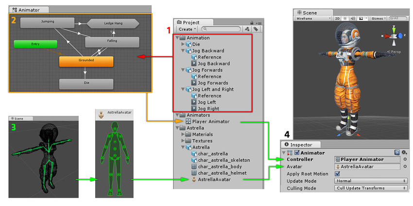
</figure>

## Animation folder

The non-code files in this section are at `BeatEmUpTemplate/Assets/Animation`.

<figure markdown="span">
    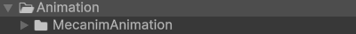
</figure>

### MecanimAnimation

The non-code files in this section are in the `MecanimAnimation` subfolder.

#### AnimationClips

<figure markdown="span">
    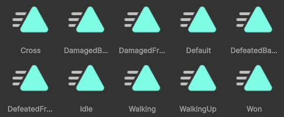
</figure>

[AnimationClips](https://docs.unity3d.com/Manual/AnimationClips.html) are imported from an external source or created within Unity. They are then placed and arranged in an AnimatorController.

#### AnimatorControllers

<figure markdown="span">
    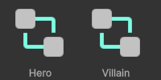
</figure>

[AnimatorControllers](https://docs.unity3d.com/Manual/class-AnimatorController.html) use state machines to determine what [AnimationClip](https://docs.unity3d.com/Manual/AnimationClips.html) to play. They are referenced by the [Animator](https://docs.unity3d.com/Manual/class-Animator.html) components on the Hero and Villain prefabs. 

## Scripting folder

The code files in this section are at `BeatEmUpTemplate/Assets/Scripting/Animation`.

<figure markdown="span">
    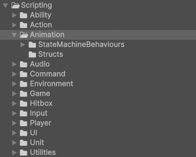
</figure>

### StateMachineBehaviours

These scripts are components that can be added to a state machine state. All classes in this folder derive from Unity's base [StateMachineBehaviour](https://docs.unity3d.com/6000.0/Documentation/ScriptReference/StateMachineBehaviour.html) class.

#### BoolClearedByIPauseAnimatorUnpauseAnimator

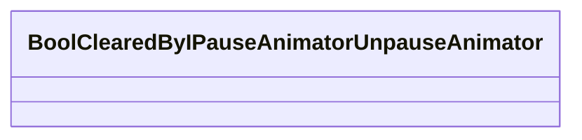

`BoolClearedByIPauseAnimatorUnpauseAnimator.cs` defines a bool parameter to be cleared if the UnpauseAnimator event is fired by an [IPauseAnimator](../utilities.md#ipauseanimator) interface implementation.

#### BoolSetByAbility

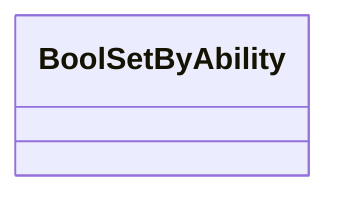

`BoolSetByAbility.cs` define a bool parameter to be set if the SetAnimationBool event is fired by an [IRaiseSetAnimationBool](../utilities.md#iraisesetanimationbool) interface implementation. It also listens for when new abilities are added via a unit's [AbilityResponder](ability.md#abilityresponders).

#### BoolSetByIDamageableDamaged

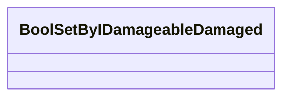

`BoolSetByIDamageableDamaged.cs` defines a bool parameter to be set if the Damaged event is fired by an [IDamageable](../utilities.md#idamageable) interface implementation.

#### BoolSetByIDamageableDamagedBack

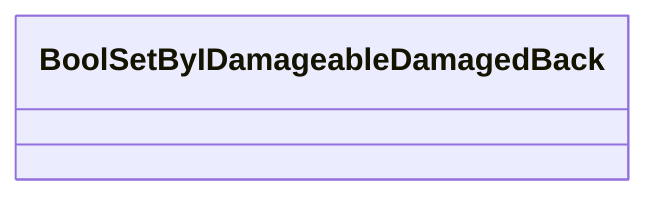

`BoolSetByIDamageableDamagedBack.cs` defines a bool parameter to be set if the DamagedBack event is fired by an [IDamageable](../utilities.md#idamageable) interface implementation.

#### BoolSetByIDefeatableDefeated

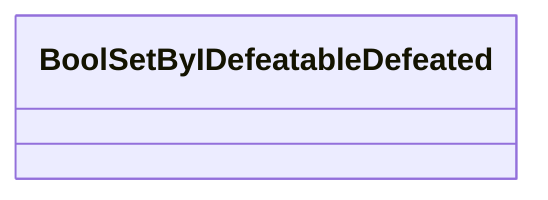

`BoolSetByIDefeatableDefeated.cs` defines a bool parameter to be set if the Defeated event is fired by an [IDefeatable](../utilities.md#idefeatable) interface implementation.

#### BoolSetByIDefeatableDefeatedBack

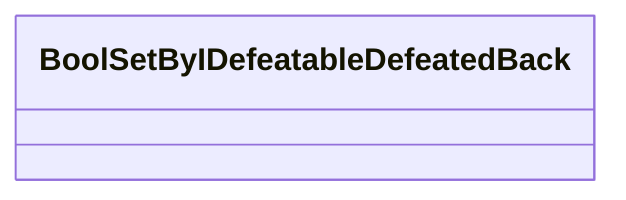

`BoolSetByIDefeatableDefeatedBack.cs` defines a bool parameter to be set if the DefeatedBack event is fired by an [IDefeatable](../utilities.md#idefeatable) interface implementation.

#### BoolSetByIPauseAnimatorPauseAnimator

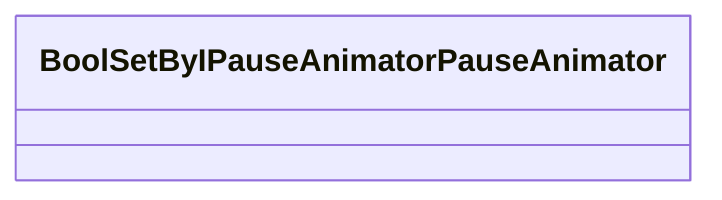

`BoolSetByIPauseAnimatorPauseAnimator.cs` defines a bool parameter to be set if the PauseAnimator event is fired by an [IPauseAnimator](../utilities.md#ipauseanimator) interface implementation.

#### BoolSetByIRaiseMoveExecutedMovement

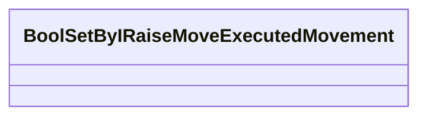

`BoolSetByIRaiseMoveExecutedMovement.cs` defines a bool parameter to be set if the MoveExecuted event is fired with a non-zero vector by an [IRaiseMoveExecuted](../utilities.md#iraisemoveexecuted) interface implementation.

#### BoolSetByIRaiseMoveExecutedNoMovement

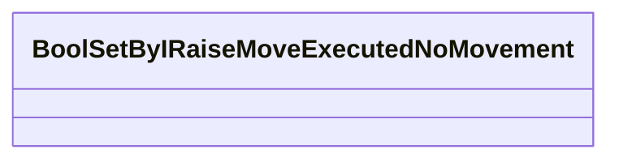

`BoolSetByIRaiseMoveExecutedNoMovement.cs` defines a bool parameter to be set if the MoveExecuted event is fired with a zero vector by an [IRaiseMoveExecuted](../utilities.md#iraisemoveexecuted) interface implementation.

#### BoolSetByIRaiseMoveExecutedNonPositiveYMovement

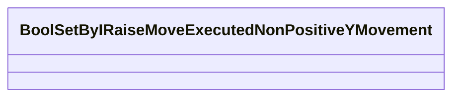

`BoolSetByIRaiseMoveExecutedNonPositiveYMovement.cs` defines a bool parameter to be set if the MoveExecuted event is fired with a non-positive y-vector by an [IRaiseMoveExecuted](../utilities.md#iraisemoveexecuted) interface implementation.

#### BoolSetByIRaiseMoveExecutedPositiveYMovement

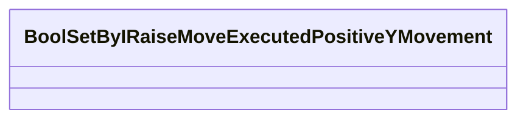

`BoolSetByIRaiseMoveExecutedPositiveYMovement.cs` defines a bool parameter to be set if the MoveExecuted event is fired with a positive y-vector by an [IRaiseMoveExecuted](../utilities.md#iraisemoveexecuted) interface implementation.

#### BoolSetByIRaiseWonWon

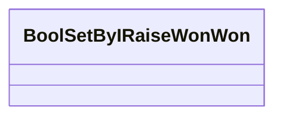

`BoolSetByIRaiseWonWon.cs` defines a bool parameter to be set if the Won event is fired by an [IRaiseWon](../utilities.md#iraisewon) interface implementation.

#### BoolSetByJumpAbility

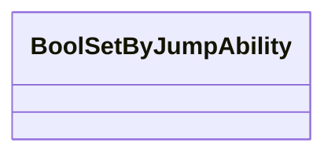

`BoolSetByJumpAbility.cs` defines a bool parameter to be set if the SetAnimationBool event is fired by a [Jump](ability.md#abilities) ability.

The difference between this script and [BoolSetByAbility](#boolsetbyability) is that it correctly subscribes to the Jump ability even when two abilities
are attached to the player's character at the same time. In the case of this template, even when the player is [BeltScrollMoving](ability.md#abilities).

#### BoolSetOnAnimationFinished

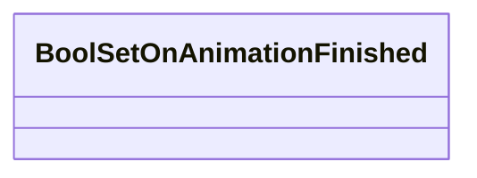

`BoolSetOnAnimationFinished.cs` defines a bool parameter to be set when the current state's animation finishes.

#### BoolSetOnStateExited

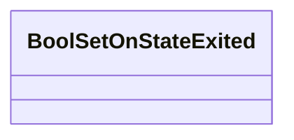

`BoolSetOnStateExited.cs` defines a bool parameter to be set when the current state exits.

#### BoolsSetByIRaiseMoveExecutedNoMovement

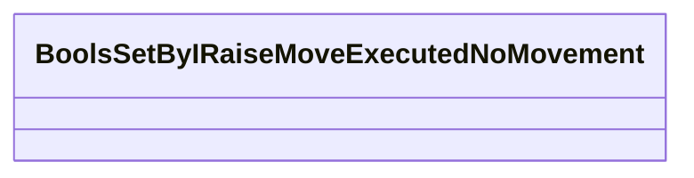

`BoolsSetByIRaiseMoveExecutedNoMovement.cs` defines multiple bool parameters to be set when the MoveExecuted event is fired with a zero vector by an [IRaiseMoveExecuted](../utilities.md#iraisemoveexecuted) interface implementation.

#### BoolsSetOnStateExited

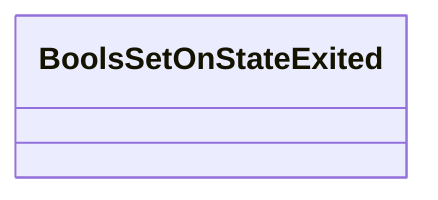

`BoolsSetOnStateExited.cs` defines multiple bool parameters to be set when the current state exits.

#### BroadcastOnStateExit

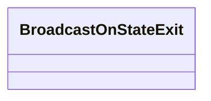

`BroadcastOnStateExit.cs` fires a StateExited event when the current state exits.

#### TriggerSetByTimer

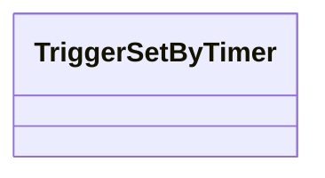

`TriggerSetByTimer.cs` defines a trigger parameter to be triggered when a set amount of time has elapsed.

### Structs

These scripts contain user-defined data types that combine fields of different types underneath a single type. All classes in this folder use the `struct` keyword in their declaration.

#### BoolParameter

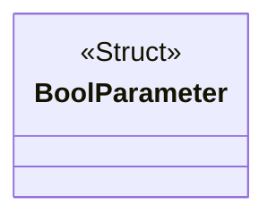

`BoolParameter.cs` is used by [StateMachineBehaviours](#statemachinebehaviours) to set a bool parameter with name 'name' to value 'value'.