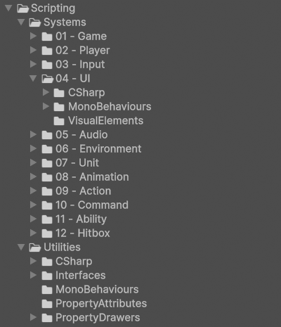

# Systems

!!! Summary

    This page outlines the twelve core systems that make up the 2.5D Beat 'Em Up Template.

## Overview

Some systems are made entirely out of code files while others have both code and non-code elements. See each system's dedicated page for more information.

- [__Ability__](ability.md) everything and anything units can do
- [__Action__](action.md) control what a unit knows how to do
- [__Animation__](animation.md) bring objects in the scene to life
- [__Audio__](audio.md) play dynamic background music and sound effects
- [__Command__](command.md) determine when in-game actions should be performed
- [__Environment__](environment.md) build immersive and responsive worlds
- [__Game__](game.md) change the game's state and direct its flow
- [__Hitbox__](hitbox.md) transfer data between two bodies through collision detection
- [__Input__](input.md) switch between different control schemes
- [__Player__](player.md) manage both human and AI players
- [__UI__](ui.md) design custom menus and transitions
- [__Unit__](unit.md) create, customize and manage the lifetime of in-game units
- [__Utilities__](utilities.md) general-purpose tools that can be used anywhere, in any game, when needed

## Scripting folder

All of the code files for each system are located at `BeatEmUpTemplate/Assets/Scripting`.

<figure markdown="span">
    
</figure>

Each folder is further divided by script type:

| 
 Folder Name | Description                          |
| ---------------: | :----------------------------------- |
| `CSharp`            | Contains scripts that are not meant to be attached to GameObjects in the scene. Many of them represent static event classes that are meant to be invoked, or are abstract classes representing concepts like [Players](player.md#players) or [Teams](unit.md#teams). |
| `Enums`            | Contains groups of related constants that are meant to be used by other scripts. All classes in these folders use the `enum` keyword in their declaration. |
| `Interfaces`            | Contain collections of method signatures and properties that can be implemented by other scripts. All classes in these folder use the `interface` keyword in their declaration.  Interfaces act like a contract; when a class implements an interface, an instance of that class can also be treated as an instance of that interface. This functionality means that two unrelated classes can be treated in the same way through an interface that they both implement. |
| `MonoBehaviours`            | Contain scripts that are meant to be attached to GameObjects in the scene as components. All classes in these folders inherit from Unity's [MonoBehaviour](https://docs.unity3d.com/6000.0/Documentation/Manual/class-MonoBehaviour.html) class. Many of them represent managers, controllers, and responders specific to scenes or prefabs. |
| `PropertyAttributes`            | Contains custom attributes for script variables. All classes in this folder derive from Unity's base [PropertyAttribute](https://docs.unity3d.com/6000.0/Documentation/ScriptReference/PropertyAttribute.html) class. |
| `PropertyDrawers`            | Contains custom drawers to control how script variables with custom PropertyAttributes appear in the Inspector. All classes in this folder derive from Unity's base [PropertyDrawer](https://docs.unity3d.com/6000.0/Documentation/ScriptReference/PropertyDrawer.html) class. |
| `ScriptableObjects`            | Contains centralized data that can be conveniently accessed from scenes and assets within a project. All classes in this folder derive from Unity's base [ScriptableObject](https://docs.unity3d.com/6000.0/Documentation/ScriptReference/ScriptableObject.html) class.  ScriptableObjects are stored on disk and live independently of GameObjects and class instances. They are used as data containers to save large amounts of data, reducing a project’s memory usage by not duplicating values. |
| `StateMachineBehaviours`            | Contains components that can be added to a state machine state. All classes in this folder derive from Unity's base [StateMachineBehaviour](https://docs.unity3d.com/ScriptReference/StateMachineBehaviour.html) class. See the [Animation](animation.md#statemachinebehaviours) page for more information. |
| `Structs`            | Contains user-defined data types that combine fields of different types underneath a single type. All classes in this folder use the `struct` keyword in their declaration. |
| `VisualElements`            | Contains objects that are part of the UIElements visual tree. All classes in this folder derive from Unity's base [VisualElement](https://docs.unity3d.com/6000.0/Documentation/ScriptReference/UIElements.VisualElement.html) class. See the [UI](ui.md#visualelements) page for more information. |