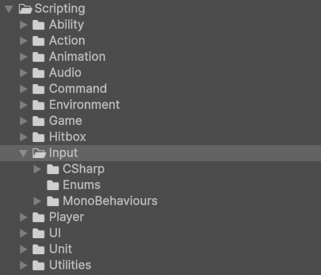

# Input

!!! Summary

    This page summarizes all aspects of the input system, which is responsible for switching between different control schemes.
    
## Design decisions

This template makes the following design decisions regarding the default way Unity handles input:

### Input system

Unity’s legacy input system is called the [Input Manager](https://docs.unity3d.com/Manual/class-InputManager.html). It is built into the Editor and is part of the core Unity platform. It is enabled by default.

In 2020 Unity released a new input system called the [Input System package](https://docs.unity3d.com/Packages/com.unity.inputsystem@1.13/manual/index.html). It is more flexible than the basic Input Manager as it allows any kind of Input Device to control Unity content. It must be installed manually through the Package Manager, after which it can either deactivate the older Input Manager or work alongside it.

!!! Warning

    Unity currently [recommends using the new Input System package](https://docs.unity3d.com/Packages/com.unity.inputsystem@1.13/manual/index.html#:~:text=It%27s%20intended%20to%20be%20a%20replacement%20for%20Unity%27s%20classic%20Input%20Manager) since they plan on removing the legacy Input Manager in the future.

<figure markdown="span">
    
</figure>

 This template uses Unity's new Input System package. See Unity’s sample project [Warriors](https://unity.com/blog/technology/learn-the-input-system-with-updated-tutorials-and-our-sample-project-warriors) for a full demonstration of the Input System’s tools and functionality. 

<figure markdown="span">
    
</figure>

## Input folder

The non-code files in this section are at `BeatEmUpTemplate/Assets/WorkingInUnity/Input`.

<figure markdown="span">
    
</figure>

### InputSystem

The non-code files in this section are in the `InputSystem` subfolder.

#### InputActionAsset

<figure markdown="span">
    
</figure>

`Controls.inputactions`is an [InputActionAsset](https://docs.unity3d.com/Packages/com.unity.inputsystem@1.0/api/UnityEngine.InputSystem.InputActionAsset.html) file that contains a set of Input Actions definitions and their associated Bindings and Control Schemes.

#### InputSettings

<figure markdown="span">
    
</figure>

`InputSystem.inputsettings` is an [InputSettings](https://docs.unity3d.com/Packages/com.unity.inputsystem@1.0/manual/Settings.html) file that represents the Input System configuration for the template. You can edit this configuration manually at `Edit/Project Settings/Input System Package/Settings`.

## Scripting

The code files in this section are at `BeatEmUpTemplate/Assets/Scripting/Input`.

<figure markdown="span">
    
</figure>

### CSharp

These scripts are not meant to be attached to GameObjects in the scene. Many of them represent static event classes that are meant to be invoked or are abstract classes representing concepts.

#### InputEvents

InputEvents contain all events related to input.

`InputEvents.cs` contains all events related to general input. This includes things like enabling or disabling all or specific player input action maps.

`TitleInputEvents.cs` contains all events related to input in the Title scene. This includes things like notifying other classes when the keybinding process has started or completed.

### Enums

These scripts contain groups of related constants that are meant to be used by other scripts. All classes in these folders use the `enum` keyword in their declaration.

#### ActionMap

`ActionMap.cs` enumerates all Action Maps in the [InputActionAsset](#inputactionasset) being used by players.

### MonoBehaviours

These scripts are meant to be attached to GameObjects in the scene as components and inherit from Unity's [MonoBehaviour](https://docs.unity3d.com/6000.0/Documentation/Manual/class-MonoBehaviour.html) class.

#### InputActionMapControllers

InputActionMapControllers control the behaviour of [PlayerInput action maps](https://docs.unity3d.com/Packages/com.unity.inputsystem@1.5/manual/PlayerInput.html#:~:text=When%20multiple%20Player%20Input%20components%20use%20the%20same%20Actions%2C%20the%20components%20automatically%20create%20private%20copies%20of%20the%20Actions) within a scene.

`InputActionMapController.cs` defines what is common across all InputActionMapControllers, regardless of game. This includes things like keeping a data structure of all [PlayerManagers](player.md#playermanagers) that the controller can modify.

`BootInputActionMapController.cs` defines InputActionMapController behaviour unique to the Boot scene. This includes things like enabling or disabling maps when a player joins or the Title scene finishes preloading. This component can be found attached to the InputActionMapController GameObject in the Boot scene.

`TitleInputActionMapController.cs` defines InputActionMapController behaviour unique to the Title scene. Things includes things like rebinding keys from the Options menu. This component can be found attached to the InputActionMapController GameObject in the Title scene.

`StageInputActionMapController.cs` defines InputActionMapController behaviour unique to stage scenes. This includes things like enabling or disabling maps on [stage win, lose, continue, game over, and win](game.md#stageevents). This component can be found attached to the InputActionMapController GameObject in the Stage scene.

!!! Note

    For this template we've defined stages as scenes where the main gameplay takes place. For now this is just the Training scene, but the stage designation also includes any future levels.