# Utilities

!!! Summary

    This page outlines the utilitiy scripts used by the 2.5D Beat 'Em Up Template. These classes don't belong to any one game system and act as general-purpose tools that can be used anywhere, in any game, when needed. 

## Scripting

The code files in this section are at `BeatEmUpTemplate/Assets/Scripting/Utilities`.

<figure markdown="span">
    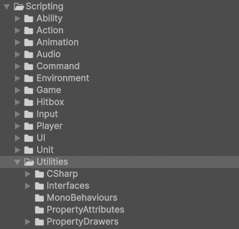
</figure>

### CSharp

These scripts are not meant to be attached to GameObjects in the scene. Many of them represent static event classes that are meant to be invoked or are abstract classes representing concepts.

#### ActionWrapper

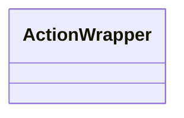

`ActionWrapper.cs` is used by [PersistentGameManager](game.md#gamemanagers) to define the EventLinks in its StateMachine. It essentially connects two nodes in the StateMachine through subscriptions to [GameEvents](game.md#gameevents).

#### StateMachine

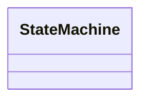

`StateMachine.cs` represents a basic, general-purpose state machine. It is used by [PersistentGameManager](game.md#gamemanagers) to represent the game's state.

##### ILink

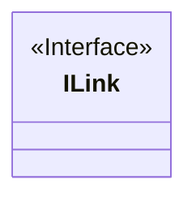

`ILink.cs` is used by [IStates](#istate) to add a link to another IState.

##### IState

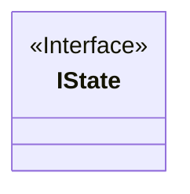

`IState.cs` is used by [PersistentGameManager](game.md#gamemanagers) to create custom states for a StateMachine.

##### EventLink

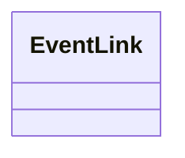

EventLinks are used to connect nodes in a StateMachine.

`EventLink.cs` is used by [PersistentGameManager](game.md#gamemanagers) to link the paused and running game states.

##### States

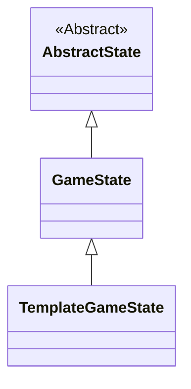

AbstractStates represent the conceptual nodes of a StateMachine while GameStates represent actual game state nodes.

`AbstractState.cs` defines what is common across all AbstractStates, regardless of game.

`GameState.cs` defines what is common across all GameStates, regardless of game.

`TemplateGameState.cs` represents the GameStates in the template.

### Interfaces

These scripts contain collections of method signatures and properties that can be implemented by other scripts. All classes in these folder use the `interface` keyword in their declaration.

Interfaces act like a contract; when a class implements an interface, an instance of that class can also be treated as an instance of that interface. This functionality means that two unrelated classes can be treated in the same way through an interface that they both implement.

#### ICanFace

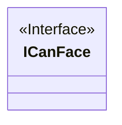

`ICanFace.cs` is implemented by classes that can face a specific [Direction](game.md#direction). It is implemented by [VillainController](unit.md#unitcontrollers) so that [BasicEnemyAI](player.md#ais) can control the direction the unit faces.

#### ICanMove

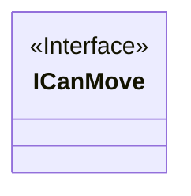

`ICanMove.cs` is implemented by classes that can move conditionally. It is implemented by [UnitController](unit.md#unitcontrollers) so that [BeltScrollMove](ability.md#abilities) can know if the unit can currently move.

#### ICanStop

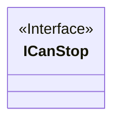

`ICanStop.cs` is implemented by classes that can stop. It is implemented by [BeltScrollMove](ability.md#abilities) so that [UnitController](unit.md#unitcontrollers) can stop the unit from moving when needed.

#### IDamageable

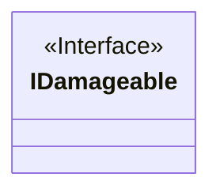

`IDamageable.cs` is implemented by classes that are damageable. It is implemented by [UnitController](unit.md#unitcontrollers) to notify [StateMachineBehaviours](animation.md#statemachinebehaviours) that the unit was damaged so that the animation state machine can update accordingly.

#### IDefeatable

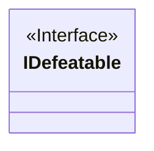

`IDefeatable.cs` is implemented by classes that are defeatable. It is implemented by [UnitController](unit.md#unitcontrollers) to notify [StateMachineBehaviours](animation.md#statemachinebehaviours) that the unit was defeated so that the animation state machine can update accordingly.

#### IHaveDamage

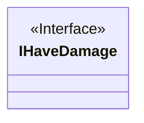

`IHaveDamage.cs` is implemented by classes that have damage. It is implemented by [JabAbilityData](ability.md#abilitydata) and [CrossAbilityData](ability.md#abilitydata) so that a target's [HurtResponder](hitbox.md#hurtresponders) knows that it has to process damage as part of its hurt response.

#### IHaveDirection

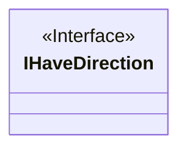

`IHaveDirection.cs` is implemented by classes that have [Direction](game.md#direction). It is implemented by [UnitController](unit.md#unitcontrollers) so that [JabHitbox](hitbox.md#hitboxes) and [CrossHitbox](hitbox.md#hitboxes) know what direction to perform their boxcasts when getting hit info from a collision.

#### IHaveFloatingHealthBar

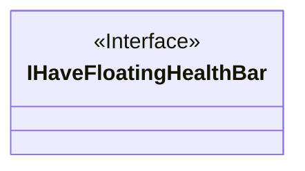

`IHaveFloatingHealthBar.cs` is implemented by classes that have a floating health bar transform. It is implemented by [VillainController](unit.md#unitcontrollers) so that [FloatingHealthBarController](ui.md#floatinghealthbarcontrollers) knows where to position the unit's floating health bar.

#### IHaveHitStun

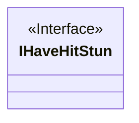

`IHaveHitStun.cs` is implemented by classes that have hitstun. It is implemented by [JabAbilityData](ability.md#abilitydata) and [CrossAbilityData](ability.md#abilitydata) so that a target's [HurtResponder](hitbox.md#hurtresponders) knows that it has to process hitstun as part of its hurt response.

#### IHaveHurtboxes

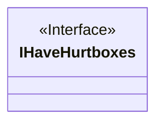

`IHaveHurtboxes.cs` is implemented by classes that have hurtboxes. It is implemented by [HeroController](unit.md#unitcontrollers) so that [BasicEnemyAI](player.md#ais) can calculate the closest possible target hurtbox.

#### IHaveHurtboxMask

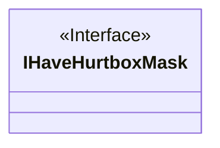

`IHaveHurtboxMask.cs` is implemented by classes that have a hurtbox mask. It is implemented by [UnitController](unit.md#unitcontrollers) so that [JabHitbox](hitbox.md#hitboxes) and [CrossHitbox](hitbox.md#hitboxes) know what type of hurtbox they collide with when active.

#### IHaveKnockback

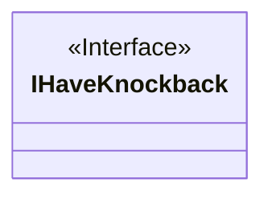

`IHaveKnockback.cs` is implemented by classes that have knockback. It is implemented by [JabAbilityData](ability.md#abilitydata) and [CrossAbilityData](ability.md#abilitydata) for two reasons:

1. So that [JabHitbox](hitbox.md#hitboxes) and [CrossHitbox](hitbox.md#hitboxes) can assign knockback direction after a collision based on hit info.
2. So that a target's [HurtResponder](hitbox.md#hurtresponders) knows that it has to process knockback as part of its hurt response.

#### IHaveMaximumHealth

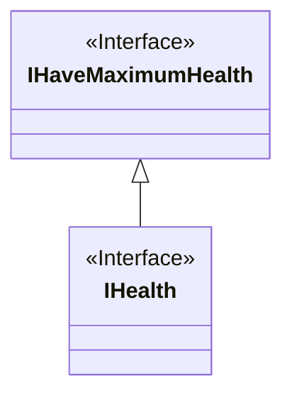

`IHaveMaximumHealth.cs` is implemented by classes that have maximum health. It is implemented by [UnitStats](unit.md#unitstats) so that a [UnitController](unit.md#unitcontrollers) can initialize its [HealthBehaviour](unit.md#unitbehaviours) with the correct maximum health.

##### IHealth

`IHealth.cs` is implemented by classes that have health. It is implemented by [UnitController](unit.md#unitcontrollers) for two reasons:

1. So that [GameplayScreenController](ui.md#screencontrollers) can initialize the Hero's health bar with the correct current and maximum health.
2. So that [FloatingHealthBarManager](ui.md#floatinghealthbarmanagers) can initialize the Villain's floating health bar with the correct current and maximum health.

#### IHaveName

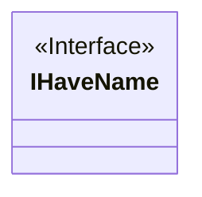

`IHaveName.cs` is implemented by classes that have a name. It is implemented by [UnitController](unit.md#unitcontrollers) so that [UnitActionManager](action.md#unitactionmanagers) can out output debug logs when attempting to perform [UnitActions](action.md#unitactions).

#### IHaveRange

``` mermaid
classDiagram
    class IHaveRange{
    <<Interface>>
    }
```

`IHaveRange.cs` is implemented by classes that have range. It is implemented by [JabUnitAction](action.md#unitactions) and [CrossUnitAction](action.md#unitactions) so that [BasicEnemyAI](player.md#ais) knows the maximum range at which to position itself in order to hit with the edge of an ability.

#### IHaveWalkSpeed

``` mermaid
classDiagram
    class IHaveWalkSpeed{
    <<Interface>>
    }
```

`IHaveWalkSpeed.cs` is implemented by classes that have walk speed. It is implemented by [UnitStats](unit.md#unitstats) and [UnitController](unit.md#unitcontrollers) for two reasons:

1. So that [TrainingAIPlayerUnitManager](unit.md#unitmanagers) can randomize Villain walk speeds within a set range of their base walk speed.
2. So that each instance of [BeltScrollMove](ability.md#abilities) can set its internal walk speed via [BeltScrollMoveUnitAction](action.md#unitactions).

#### IPausable

``` mermaid
classDiagram
    class IPausable{
    <<Interface>>
    }
```

`IPausable.cs` is implemented by classes that are pausable. It is implemented by [BeltScrollMove](ability.md#abilities) to allow a [UnitController](unit.md#unitcontrollers) to pause and unpause its behavior.

#### IPauseAnimator

``` mermaid
classDiagram
    class IPauseAnimator{
    <<Interface>>
    }
```

`IPauseAnimator.cs` is implemented by classes that can pause the animator. It is implemented by [UnitController](unit.md#unitcontrollers) to notify [StateMachineBehaviours](animation.md#statemachinebehaviours) that the unit was paused so that the animation state machine can update accordingly.

#### IRaiseMoveExecuted

``` mermaid
classDiagram
    class IRaiseMoveExecuted{
    <<Interface>>
    }
```

`IRaiseMoveExecuted.cs` is implemented by classes that raise a move executed event. It is implemented by [BeltScrollMove](ability.md#abilities) for two reasons:

1. So that [HeroController](unit.md#unitcontrollers) can have the unit face the direction it is moving.
2. To notify [StateMachineBehaviours](animation.md#statemachinebehaviours) that the unit is moving so that the animation state machine can update accordingly.

#### IRaiseSetAnimationBool

``` mermaid
classDiagram
    class IRaiseSetAnimationBool{
    <<Interface>>
    }
```

`IRaiseSetAnimationBool.cs` is implemented by classes that set an animation bool. It is implemented by [Jab](ability.md#abilities) and [Cross](ability.md#abilities) to notify [StateMachineBehaviours](animation.md#statemachinebehaviours) that the user is executing an ability so that the animation state machine can update accordingly.

#### IRaiseWon

``` mermaid
classDiagram
    class IRaiseWon{
    <<Interface>>
    }
```

`IRaiseWon.cs` is implemented by classes that raise a win. It is implemented by [UnitController](unit.md#unitcontrollers) to notify [StateMachineBehaviours](animation.md#statemachinebehaviours) that the unit has won so that the animation state machine can update accordingly.

### MonoBehaviours

These scripts are meant to be attached to GameObjects in the scene as components and inherit from Unity's [MonoBehaviour](https://docs.unity3d.com/6000.0/Documentation/Manual/class-MonoBehaviour.html) class.

#### HorizontalDolly

``` mermaid
classDiagram
    class HorizontalDolly{
    }
```

`HorizontalDolly.cs` is used to have the x-position of a GameObject follow the x-position of a human player unit. This component can be found attached to the MainCamera GameObject in the Training scene.

#### Lerp

``` mermaid
classDiagram
    class Lerp{
    }
```

`Lerp.cs` is used to animate a GameObject's movement between two points. This component can be found attached to the Clouds GameObject in the Title scene.

####  LoadSceneOnStart

``` mermaid
classDiagram
    class LoadSceneOnStart{
    }
```

`LoadSceneOnStart.cs` is used to immediately load a new scene. This component can be found attached to the Initializer GameObject in the Initialization scene and the SceneLoader GameObject in the Persistent scene.

#### MatchScaleXSignWithTransform

``` mermaid
classDiagram
    class MatchScaleXSignWithTransform{
    }
```
`MatchScaleXSignWithTransform.cs` is used to have a GameObject's scale x sign always copy that of another GameObject's scale x sign. This component can be found attached to the UI GameObject of Human prefab and its Hero and Villain prefab variants. These prefabs are instantiated as children of the HumanPlayerUnitManager and AIPlayerUnitManager GameObjects in the Training scene at runtime.

### PropertyAttributes

These scripts contain custom attributes for script variables. All classes in this folder derive from Unity's base `PropertyAttribute` class.

#### ReadOnlyAttribute

``` mermaid
classDiagram
    class ReadOnlyAttribute{
    }
```

`ReadOnlyAttribute.cs` is used to denote fields that are read-only in the Unity Editor Inspector window.

#### RenameAttribute

``` mermaid
classDiagram
    class RenameAttribute{
    }
```

`RenameAttribute.cs`  is used to change a field's name in the Unity Editor Inspector window.

### PropertyDrawers

These scripts contain custom drawers to control how script variables with custom PropertyAttributes appear in the Inspector. All classes in this folder derive from Unity's base `PropertyDrawer` class.

#### ReadOnlyPropertyDrawer

``` mermaid
classDiagram
    class ReadOnlyPropertyDrawer{
    }
```

`ReadOnlyPropertyDrawer.cs` controls how the serializable ReadOnlyAttribute class looks in the inspector.

#### RenamePropertyDrawers

``` mermaid
classDiagram
    class RenamePropertyDrawers{
    }cls
```

`RenamePropertyDrawer.cs` controls how the serializable RenameAttribute class looks in the inspector.