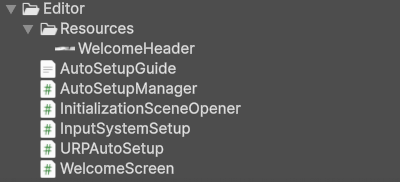

# Unity Editor

!!! Summary

    This page describes how the Unity environment is organized for the template. It can help you navigate through the project’s files or bring up details you may want to consider when organizing your own game.

## Automatic setup

This package includes automatic setup features to ensure a smooth experience when importing into a Unity project. These scripts are located at `BeatEmUpTemplate/Assets/Scripting/Editor`.

<figure markdown="span">
    
</figure>

Once the import is detected `AutoSetupManager.cs` runs all setup tasks in sequence:

1. Configures the Input System (`InputSystemSetup.cs`)
2. Sets up URP assets (`URPAutoSetup.cs`)
3. Opens the Initialization scene (`InitializationSceneOpener.cs`)
4. Shows the Welcome screen (`WelcomeScreen.cs`)

You can also manually run the setup by selecting `Window > Arcabidi > 2.5D Beat 'Em Up Template > Run Auto Setup`. See `AutoSetupGuide.txt` for more information.

## Project window

<figure markdown="span">
    
</figure>

The [Project window](https://docs.unity3d.com/Manual/ProjectView.html) is located in the bottom left corner of the Unity Editor by default. The following is a general description of each major folder contained within.

| 
 Folder Name | Description                          |
| ---------------: | :----------------------------------- |
| `AddressableAssetsData`            | A folder that is automatically created when you install the Addressables package from the Unity Package Manager.  This folder contains all the settings files for managing Addressables, which help you organize and package content for your application as well as load and release assets at runtime.  See the [Assets](assets.md#addressableassetsdata-folder) page for more information. |
| `Arcabidi`            |  The company folder for all products created by Arcabidi. |
| `BeatEmUpTemplate`            | The main folder for all files related to the 2.5D Beat 'Em Up Template. |
| `Assets`            | Contains all assets related to the 2.5D Beat 'Em Up Template. Its subfolders are named after sections from the online [Unity 6 User Manual](https://docs.unity3d.com/6000.0/Documentation/Manual/UnityManual.html) to allow quick references to official documentation.  |
| `Animation`            | Contains all non-code files related to animation. See the [Animation](systems/animation.md#animation-folder) page for more information. |
| `Audio`            | Contains all non-code files related to audio. See the [Audio](systems/audio.md#audio-folder) page for more information. |
| `MaterialsAndShaders`            | Contains all non-code files related to how surfaces are rendered. See the [Materials](https://docs.unity3d.com/Manual/Materials.html) and [Textures](https://docs.unity3d.com/Manual/Textures-landing.html) pages in the Unity 6 User Manual for more information. |
| `Rendering`            | Contains all non-code files related to how scene content is displayed on screen. See the [Universal Render Pipeline asset](https://docs.unity3d.com/Manual/urp/urp-asset-and-renderer.html) page in the Unity 6 User Manual for more information. |
| `Scripting`            | Contains all code files. See the [Systems](systems/index.md#scripting-folder) page for more information. |
| `Video`            | Contains all non-code files related to video. See the [Video Clip Importer](https://docs.unity3d.com/Manual/class-VideoClip.html) page in the Unity 6 User Manual for more information.|
| `WorkingInUnity`            | Contains all non-code files related to working in Unity. |
| `GameObjects`            | Contains all non-code files related to GameObjects. See the [Models](https://docs.unity3d.com/Manual/models.html) and [Prefabs](https://docs.unity3d.com/Manual/Prefabs.html) pages in the Unity 6 User Manual for more information. |
| `Input`            | Contains all non-code files related to input. See the [Input](systems/input.md#input-folder) page for more information.|
| `Scenes`            | Contains all non-code files related to scenes. See the [Scenes](scenes.md) page for more information. |
| `UI`            | Contains all non-code files related to UI. See the [UI](systems/ui.md#ui-folder) page for more information.|
| `Licenses`            | Contains all licenses associated with any third party assets used in the package. `Third-Party Notices.txt` details which asset uses which license. |

## Hierarchy window

<figure markdown="span">
    
</figure>

The [Hierarchy window](https://docs.unity3d.com/Manual/Hierarchy.html) is located in the top left corner of the Unity Editor by default. For this template GameObjects in the hierarchy have been divided based on the [system](systems/index.md) they belong to and sorted by their transforms rather than alphanumerically. For example, in the Training scene above the UIManager is placed under the UI system while the AudioManager is placed under the Audio system.

!!! Info

    Unity uses this same format for the hierarchy window in its own [sample projects](https://assetstore.unity.com/packages/essentials/tutorial-projects/dragon-crashers-urp-2d-sample-project-190721?srsltid=AfmBOoqwWEulvRLm8O6SG66BZFlzVuN-H4BR2vGijbf-9IsTwyJstfzF). <figure markdown="span">
    </figure>