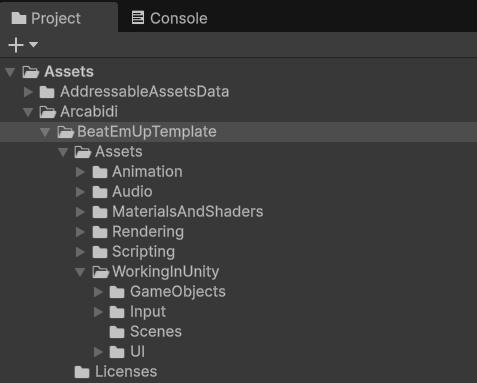

# Unity Editor

!!! Summary

    This page describes how the Unity environment is organized for the template. It can help you navigate through the project’s files or bring up details you may want to consider when organizing your own game.

## Project window

<figure markdown="span">
    
</figure>

The [Project window](https://docs.unity3d.com/Manual/ProjectView.html) is located in the bottom left corner of the Unity Editor by default. The following is a general description of each major folder contained within.

| 
 Folder Name | Description                          |
| ---------------: | :----------------------------------- |
| `AddressableAssetsData`            | A folder that is automatically created when you install the Addressables package from the Unity Package Manager.  This folder contains all the settings files for managing Addressables, which help you organize and package content for your application as well as load and release assets at runtime.  See the [Assets](assets.md#addressableassetsdata-folder) page for more information. |
| `Arcabidi`            |  The company folder for all products created by Arcabidi. |
| `BeatEmUpTemplate`            | The main folder for all files related to the 2.5D Beat 'Em Up Template. |
| `Assets`            | Contains all assets related to the 2.5D Beat 'Em Up Template. Its subfolders are named after sections from the online [Unity 6 User Manual](https://docs.unity3d.com/6000.0/Documentation/Manual/UnityManual.html) to allow quick references to official documentation.  |
| `Animation`            | Contains all non-code files related to animation. See the [Animation](scripting/systems/animation.md#animation-folder) page for more information. |
| `Audio`            | Contains all non-code files related to audio. See the [Audio](scripting/systems/audio.md#audio-folder) page for more information. |
| `MaterialsAndShaders`            | Contains all non-code files related to how surfaces are rendered. See the [Materials](https://docs.unity3d.com/Manual/Materials.html) and [Textures](https://docs.unity3d.com/Manual/Textures-landing.html) pages in the Unity 6 User Manual for more information. |
| `Rendering`            | Contains all non-code files related to how scene content is displayed on screen. See the [Universal Render Pipeline asset](https://docs.unity3d.com/Manual/urp/urp-asset-and-renderer.html) page in the Unity 6 User Manual for more information. |
| `Scripting`            | Contains all code files. See the [Scripting](scripting/index.md) page for more information. |
| `Video`            | Contains all non-code files related to video. See the [Video Clip Importer](https://docs.unity3d.com/Manual/class-VideoClip.html) page in the Unity 6 User Manual for more information.|
| `WorkingInUnity`            | Contains all non-code files related to working in Unity. |
| `2D`            | Contains all non-code files related to 2D development. See the [PSD Importer](https://docs.unity3d.com/Packages/com.unity.2d.psdimporter@9.0/manual/index.html) page in the Unity 6 User Manual for more information. |
| `GameObjects`            | Contains all non-code files related to GameObjects. See the [Models](https://docs.unity3d.com/Manual/models.html) and [Prefabs](https://docs.unity3d.com/Manual/Prefabs.html) pages in the Unity 6 User Manual for more information. |
| `Input`            | Contains all non-code files related to input. See the [Input](scripting/systems/input.md#input-folder) page for more information.|
| `Scenes`            | Contains all non-code files related to scenes. See the [Scenes](scenes.md) page for more information. |
| `UI`            | Contains all non-code files related to UI. See the [User Interface](scripting/systems/user-interface.md#ui-folder) page for more information.|
| `Packages`            | Contains a`manifest.json` file that lists all package dependencies in the 2.5D Beat 'Em Up Template for reference. |
| `ProjectSettings`            | Contains all [project settings](https://docs.unity3d.com/Manual/comp-ManagerGroup.html) for the 2.5D Beat 'Em Up Template:  `DynamicsManager` configures [physics collision matrices](https://docs.unity3d.com/Manual/LayerBasedCollision.html). `GraphicsSettings` sets the [default render pipeline](https://docs.unity3d.com/Manual/class-GraphicsSettings.html#:~:text=Always%2Dincluded%20Shaders-,Set%20Default%20Render%20Pipeline%20Asset,-Use%20the%20Default). `QualitySettings` sets the [render pipeline asset](https://docs.unity3d.com/Manual/class-QualitySettings.html#:~:text=Meshes-,Rendering,-Property). `TagManager` defines [tags and layers](https://docs.unity3d.com/Manual/class-TagManager.html).  It is recommended to import this package to a clean Unity project to prevent overwriting any existing project settings. After creating one, copy these files to the `[Your Project]/ProjectSettings` folder to overwrite the default project settings. |

## Hierarchy window

<figure markdown="span">
    
</figure>

The [Hierarchy window](https://docs.unity3d.com/Manual/Hierarchy.html) is located in the top left corner of the Unity Editor by default. For this template GameObjects in the hierarchy have been divided based on the [system](scripting/systems/index.md) they belong to and sorted by their transforms rather than alphanumerically. For example, in the Training scene above the UIManager is placed under the UI system while the AudioManager is placed under the Audio system.

!!! Info

    Unity uses this same format for the hierarchy window in its own [sample projects](https://assetstore.unity.com/packages/essentials/tutorial-projects/dragon-crashers-urp-2d-sample-project-190721?srsltid=AfmBOoqwWEulvRLm8O6SG66BZFlzVuN-H4BR2vGijbf-9IsTwyJstfzF). <figure markdown="span">
    </figure>